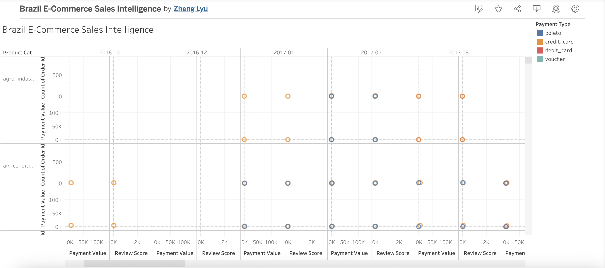

## 📦 Brazil E-Commerce Sales Data Pipeline

This project analyzes a real-world e-commerce dataset from Brazil, focusing on sales performance, delivery efficiency, and regional trends. It demonstrates end-to-end data analytics capabilities including cleaning, transformation, and dashboard building using SQL, Python, Power BI, and Tableau.

---

## 🗂️ Project Structure

```
01_brazil_e-commerce_sales_intelligence/
├── data/
│   ├── olist_raw_data.zip                  # Original raw dataset
│   └── olist_cleaned_final.zip             # Final cleaned dataset
├── scripts/
│   ├── onlist_cleaned_dataset.sql          # SQL Data extraction & transformation script
│   └── onlist_cleaned_dataset.python       # Python data cleaning script
├── dashboard/
│   ├── brazil_ecommerce_dashboard.pbix     # Power BI dashboard file
│   ├── powerbi_dashboard.pbix.png          # Power BI dashboard preview image
│   ├── brazil_ecommerce_dashboard.twbx     # Tableau workbook
│   └── tableau_dashboard.preview.png       # Tableau dashboard preview image
└── README.md 
```

---

## 📥 Dataset Source

This project uses the [Brazilian E-Commerce Public Dataset by Olist](https://www.kaggle.com/datasets/olistbr/brazilian-ecommerce) from Kaggle.  
The dataset contains detailed transaction records including order status, product category, customer location, reviews, and more.

---

## 🧼 Data Cleaning

- The original dataset was downloaded from [Kaggle - Brazilian E-Commerce Public Dataset](https://www.kaggle.com/datasets/olistbr/brazilian-ecommerce).
- Cleaning was performed using both SQL and Python (see `onlist_cleaned_dataset.*`).
- Final cleaned data is exported to `olist_cleaned_final.zip`.

---

## 💡 Key Insights

- Top-performing states and products
- Delivery time vs review score
- Revenue trends and shipment efficiency

---

## 📈 Power BI Dashboard

📁 File: `brazil_ecommerce_dashboard.pbix`  
📷 Preview:


**Includes:**

- Product Category Sales Overview (bar chart)
- Payment Type Distribution (pie chart)
- Customer Review Trend Over Time (line chart)

> Open `.pbix` using Power BI Desktop to explore the interactive visuals.

---

## 📊 Tableau Dashboard

📁 File: `brazil_ecommerce_dashboard.twbx`  
📷 Preview:


**Includes:**

- Top Categories by Revenue
- Payment Method Breakdown
- Review Score Distribution by Month
 
> Open `.twbx` using Tableau Public (free) or Tableau Desktop 2022.1+.

---

## ✅ Tools Used

- Python: Pandas, Numpy, Matplotlib
- SQL: SQLite used for querying multiple relational tables
- Microsoft Power BI: Built interactive dashboards and visual analytics
- Tableau Public: Alternative BI tool for dashboard comparison
- Google Colab/Github: For cloud-based development and collaboration

---

## 📬 Contact

For access to live Tableau/Power BI links or collaboration requests, feel free to reach out via LinkedIn https://www.linkedin.com/in/zheng-lyu-951295323/.

🛒 Brazil E-Commerce Sales Intelligence Pipeline

📦 Project Overview  
This project analyzes Brazilian e-commerce data from Kaggle (Olist) and builds a full data intelligence pipeline.  
From structured data queries to Python-based analysis and BI dashboards, it demonstrates an end-to-end solution for e-commerce performance monitoring and optimization.

🎯 Business Objective  
To help e-commerce businesses and logistics teams gain insights into delivery efficiency, customer satisfaction, and product category performance.

🧱 Data Pipeline Architecture  
- **Data Source:** Olist Brazilian E-Commerce Dataset (Kaggle)  
- **SQL Query Layer:** SQLite to extract relational metrics across sellers, orders, payments, and reviews  
- **Python Processing:** Data cleaning, delay flagging, freight analysis (Google Colab)  
- **Visualization Layer:**  
  - Tableau: Product category distribution, review score heatmaps  
  - Power BI: Delivery delay vs. cost scatter plots, review timeline, payment type comparison  

🧰 Tech Stack  
- **Languages:** SQL (SQLite), Python (pandas, matplotlib)  
- **Platforms:** Google Colab, GitHub, Kaggle  
- **Visualization Tools:** Tableau Public, Power BI  
- **Data Size:** 100K+ orders, 50K+ customers, 120K+ reviews  

📊 Key Insights  
- 📦 Top-selling product categories by revenue and volume  
- 🚚 Freight cost vs. delivery delay correlation  
- 💬 Review score trends and patterns  
- 💰 Payment type behavior vs customer satisfaction  

📁 Repository Structure
/01_brazil_ecommerce_data_pipeline
│
├── data/
│   ├── olist_raw_data.zip               # Original Kaggle dataset (all CSVs)
│   └── olist_cleaned_final.zip          # Final cleaned dataset used for analysis
│
├── scripts/
│   ├── onlist_cleaned_dataset.sql       # SQL script for data extraction & cleaning
│   └── onlist_cleaned_dataset.python    # Python script for EDA & processing (Colab)
│
├── dashboard/
│   ├── brazil_ecommerce_dashboard.pbix      # Power BI dashboard file
│   ├── powerbi_dashboard.pbix.png           # Power BI dashboard preview image
│   ├── brazil_ecommerce_dashboard.twbx      # Tableau workbook file
│   └── tableau_dashboard.preview.png        # Tableau dashboard preview image
│
└── README.md                             # Full pipeline and documentation
、、、


🔗 GitHub Project  
[Click to view project](https://github.com/ZhengLyu-Data/01_brazil_ecommerce_data_pipeline)

---

## ✅ Author & Project Statement

This project was independently designed, implemented, and documented by **Zheng Lyu** as part of a professional data engineering portfolio.  
It integrates structured querying, Python preprocessing, and dashboarding to demonstrate a complete retail intelligence pipeline.

## 📬 Contact  
For questions or collaboration opportunities, please connect via LinkedIn: [Zheng Lyu](https://www.linkedin
