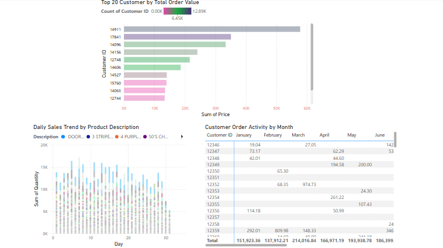
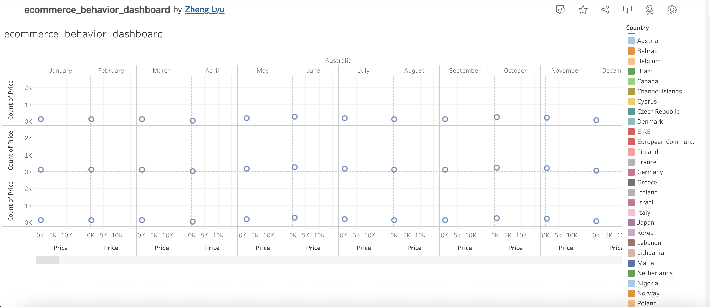
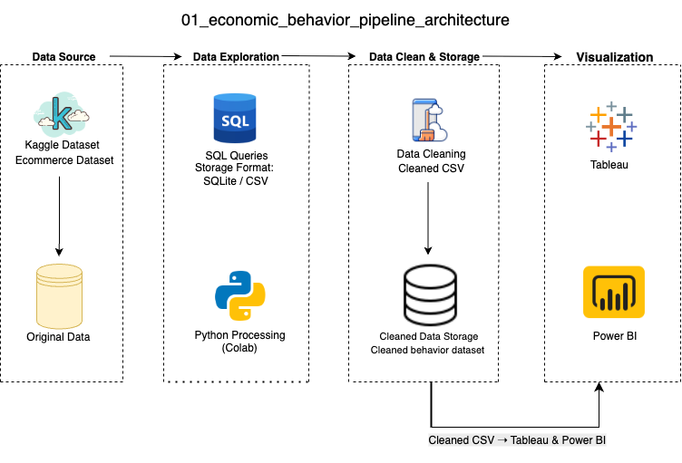

## Overview

This project analyzes online customer purchasing behavior using the UCI Online Retail II dataset. The goal is to identify top customers, evaluate product performance over time, and visualize purchasing patterns using Power BI. The pipeline includes data cleaning with Python and interactive dashboard creation.

## Data Visualization

Below are the screenshots of the final dashboards created in Power BI and Tableau.

Power BI Dashboard

Tableau Dashboard

## Data Architecture

We chose Power BI for interactive visualization and Python for efficient data wrangling. This architecture allows non-technical users to filter and explore insights while maintaining a reproducible backend pipeline.

## Prerequisites

Before running the project, ensure the following:

- 1.Python 3.x installed or use Google Colab
- 2.Install pandas, numpy, and openpyxl
- 3.Power BI Desktop installed (for .pbix file viewing)
- 4.Place online_retail_II.xlsx into the data/ directory

## How to Run This Project
Run the preprocessing script:

1. python and SQL scripts/preprocessing.py
   The script will output:

2. Cleaned CSV: data/ecommerce_cleaned.csv
   Open dashboard/ecommerce_behavior in Power BI Desktop and Tableau, Interact with filters and visuals on the dashboard

🧩 Note on SQL Compatibility:
All SQL scripts in this project are designed using standard SQL syntax. While executed with SQLite for simplicity, the same structure is compatible with MySQL or PostgreSQL by changing the database connector and placeholder syntax (`?` → `%s`).
   
## Lessons Learned

Invoice and Description fields contain too many unique values; require summarization
Power BI visuals require field aggregation (e.g., sum, count) to be meaningful
Visual filtering helps highlight high-value users and product seasonality
Pre-aggregating in Python reduces dashboard load time significantly

## Contact

Please feel free to contact me if you have any questions: LinkedIn，Twitter
