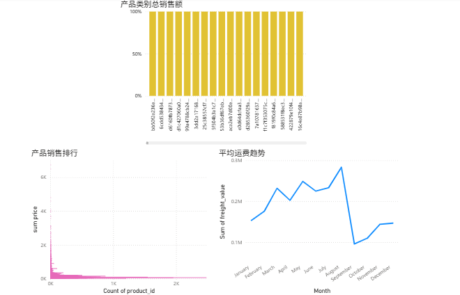
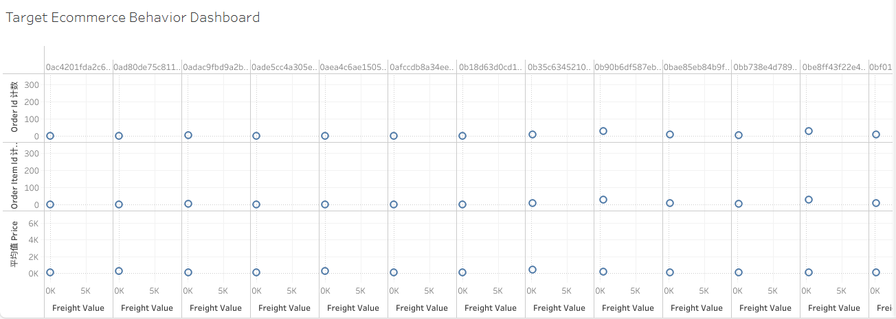
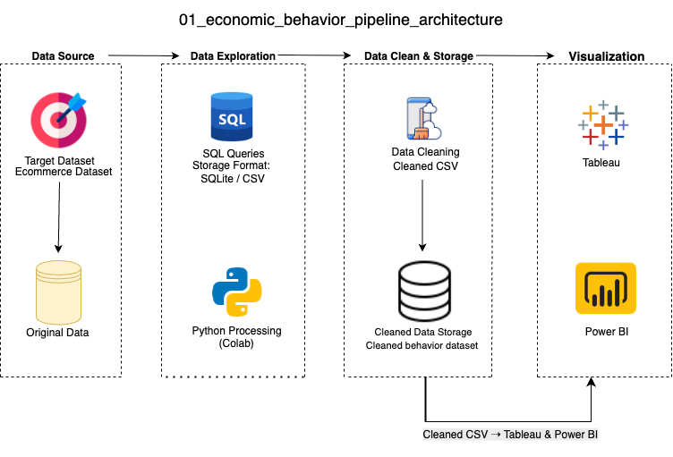

## Overview 项目总览  
Analyzed Target USA e-commerce order data to identify sales trends and customer behavior patterns. Data cleaning and SQL queries were performed in Python, with insights visualized in Tableau and Power BI.

** 中文说明 (项目简介) **  分析美国塔吉特（Target）电商订单数据，识别销售趋势与用户行为模式。使用 Python 进行数据清洗与 SQL 查询，并在 Tableau 和 Power BI 中完成可视化。

## Data Visualization 数据可视化

- This section presents customer behavior analysis dashboards built with Power BI and Tableau, covering key dimensions such as user distribution, return frequency, and time-based trends.
  * 本部分展示了使用 Power BI 和 Tableau 构建的客户购买行为分析图表，涵盖用户分布、退货频率与时间趋势等核心维度。

- Below are screenshots of the final visualizations:  
  * 以下为本项目生成的最终可视化图表示例截图：

Power BI Dashboard 数据可视化



Tableau Dashboard 数据可视化



## Data Architecture 数据流程图  

- The project uses Python for preprocessing to build a cleaned dataset and leverages Power BI to visualize customer behavior patterns, making it suitable for interactive analysis by non-technical users.
  * 项目使用 Python 进行预处理，构建清洗数据集，并通过 Power BI 可视化客户行为路径，适合非技术用户交互分析。



- We chose Power BI for interactive visualization and Python for efficient data wrangling. This architecture allows non-technical users to filter and explore insights while maintaining a reproducible backend pipeline.
  * 我们选择使用 Power BI 进行交互式可视化，Python 用于高效的数据清洗处理。该架构既支持非技术用户进行筛选与洞察探索，又能保持后端流程的可复现性。

## SQL Analysis SQL 分析

- Query: Top 10 Countries by Total Sales  
  *（按国家统计销售总额前十）

```sql
SELECT Country,
       SUM(UnitPrice * Quantity) AS TotalSales
FROM retail_data
GROUP BY Country
ORDER BY TotalSales DESC
LIMIT 10;
```

** Insight 洞察：**  
- Sales are heavily concentrated in the UK, with other countries contributing smaller volumes.
  * 销售额主要集中在英国市场，其他国家贡献相对较小。

## Prerequisites 环境依赖  

- Before running the project, ensure the following:
  * 在运行本项目之前，请确保以下环境准备已完成：
    
- Python 3.10 or above is recommended. 
  * 推荐使用 Python 3.10 以上版本.
    
- Google Colab or local Jupyter environment
  * 推荐使用 Google Colab 直接运行，亦支持本地 Jupyter 环境，只需配置好 Python 即可。

- Taleau / Power BI
  * Tableau, Power BI 用于仪表板和数据可视化
    
- SQLite (optional for local storage)
  * 可选：同样可以用于本地执行 SQL 查询的轻量数据库 SQLite

- All SQL scripts in this project are designed using standard SQL syntax. While executed with SQLite for simplicity, the same structure is compatible with MySQL or PostgreSQL by   changing the database connector and placeholder syntax (? → %s).
  * 本项目 SQL 脚本采用标准语法，可在 SQLite、MySQL、PostgreSQL 等数据库中灵活迁移，需根据数据库修改连接方式与参数占位符。
    
- This project can be executed both on Google Colab and local Jupyter Notebook.
  * 所有脚本支持在 Google Colab 中直接运行，同时也兼容本地 Jupyter Notebook 环境。只需确保 Python 3.x 与相关库已正确安装，即可在本地复现全部流程与输出结果。
    
## How to Run This Project 如何运行本项目

- Before running the project, ensure the following:
  * 在运行本项目之前，请确保以下环境准备已完成：

- Step 1: Clean raw Target e-commerce data using Python (clean_data.py)
  * 第一步：使用 Python 对塔吉特百货原始数据进行清洗，包括缺失值处理、数据类型转换等

- Step 2: Build processing pipeline and export intermediate dataset (pipeline.py)
  * 第二步：构建数据管道，将清洗后数据输出为中间 CSV 文件，供后续分析使用

- Step 3: Visualize trends and metrics using Python (run_pipeline.py)
  * 第三步：使用 Python 生成关键分析图表（如用户活跃度、购买分布等）

- Step 4: Execute SQL queries for KPI extraction (queries.sql)
  * 第四步：使用 SQL 提取核心指标，用于后续仪表板构建（可在 SQLite / Azure Data Studio 中运行）

- Step 5: Create dashboards using Tableau and Power BI
  * 第五步：将 Python 清洗结果导入 Tableau 与 Power BI，构建多维度数据仪表板

- All SQL scripts in this project are designed using standard SQL syntax. While executed with SQLite for simplicity, the same structure is compatible with MySQL or PostgreSQL by changing the database connector and placeholder syntax (`?` → `%s`).
  * 所有 SQL 脚本基于标准语法编写，当前以 SQLite 运行为主，如需移植到 MySQL/PostgreSQL，仅需修改数据库连接方式及参数占位符格式（如 `?` → `%s`）。

- This project can be executed both on Google Colab and local Jupyter Notebook.
  * 所有脚本支持在 Google Colab 中直接运行，同时也兼容本地 Jupyter Notebook 环境。只需确保 Python 3.x 与相关库已正确安装，即可在本地复现全部流程与输出结果。

- The cleaned dataset is provided as a `.zip` file due to its large size.  Please unzip `online_retail_II_cleaned.csv.zip` before executing the Python scripts or dashboards.
  * 由于数据体积较大，清洗后数据以 `.zip` 格式提供。使用前请先解压。

## Lessons Learned 学习亮点 

- Data dimensions should be properly aggregated, as too many fields can reduce chart readability. The preprocessing step can significantly improve dashboard loading speed.
  * 数据维度需合理聚合，字段太多会降低图表可读性。预处理环节可以极大提升最终仪表板加载速度。

 - Invoice and Description fields contain too many unique values; require summarization
   * 发票号与产品描述字段具有高基数，建议进行预聚合处理
     
 - Power BI visuals require field aggregation (e.g., sum, count) to be meaningful
   * 在 Power BI 中需使用聚合函数（如 SUM、COUNT）以生成可读图表
     
 - Visual filtering helps highlight high-value users and product seasonality
   * 使用筛选器可以识别高价值客户及产品的季节性趋势
     
 - Pre-aggregating in Python reduces dashboard load time significantly
   * 在 Python 中提前聚合数据可显著提升仪表板加载效率与交互性能
