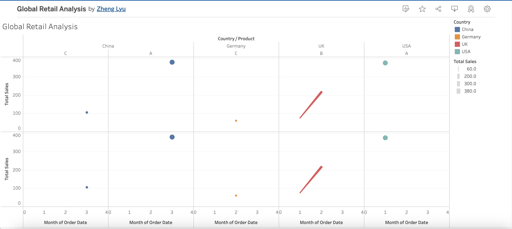

# 🌍 Global Retail Analytics

## 🖼️ Dashboard Preview

This project analyzes global retail sales across time, country, and product lines using Python and Tableau.

## 🔧 Tools
- **Python (Google Colab)** for data cleaning and transformation
- **Tableau Public** for interactive visualization
- **GitHub** for version control and showcase

## 📊 Visualizations
1. 📈 Sales Trend Over Time  
2. 📊 Sales by Country  
3. 🥧 Sales by Product  

👉 [Click here to view the final dashboard](https://public.tableau.com/app/profile/zheng.lyu6601/viz/GlobalRetailAnalysis_17487317429280/GlobalRetailAnalysis#1)

## 🧼 Dataset
- Source: Sample dataset (retail_sales_sample.csv)
- Cleaned using `pandas` and uploaded to Tableau

## 📎 Summary
This is the first of four data portfolio projects designed to showcase cloud-based data analysis workflows using AI-assisted Python in Colab and interactive dashboards in Tableau Public.

## 📓 Usage Note

The file `Notebook.ipynb` is a standard **Jupyter Notebook (.ipynb)** created and executed in **Google Colab**.

To preserve execution history and cell output, we retained the original filename.  
Please open the notebook with Google Colab to fully experience the code, outputs, and visuals.

👉 How to open: Copy the repo URL → Go to Google Colab → File → Open notebook → GitHub tab → Paste URL
