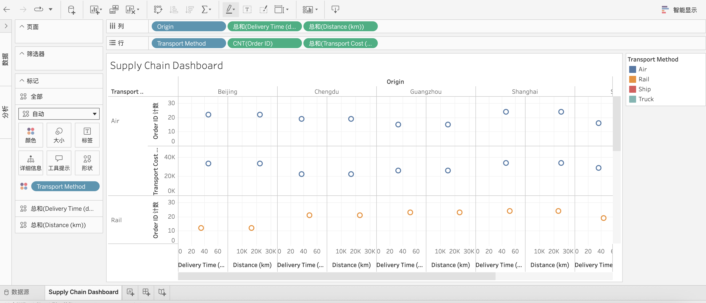

# 📦 Project 2: Supply Chain Dashboard

This project showcases supply chain data processing and cross-platform analytics using Python, SQL, and Tableau—all within a cloud-based environment.

---

## 📊 Project Goals

- Clean and analyze order-level supply chain data
- Visualize insights in Tableau Public
- Simulate SQL queries using SQLFiddle (MySQL 5.6)
- Demonstrate cloud-native workflow using Google Colab and browser-based tools

---

## 🧼 Data Cleaning (Google Colab)

The original CSV file was cleaned using Python in Google Colab.

**Key steps:**
- Remove duplicates
- Convert date fields
- Export `cleaned_supply_orders.csv` for visualization

🔗 Notebook: [Colab Link](https://colab.research.google.com/drive/14xYDYSa90cUVil0eGwcW7EgnkBmTVQCa)

---

## 📈 Tableau Dashboard

Tableau Public was used to create an interactive dashboard featuring:

- Order quantity by product
- Shipment breakdown by supplier
- Monthly trend visualization

📌 [Live Dashboard](https://public.tableau.com/app/profile/zheng.lyu6601/viz/SupplyChainDashboard_17487579608020/SupplyChainDashboard#2)

🖼️ Preview Screenshot:

---

## 🧠 SQL Simulation (via SQLFiddle)

SQL queries were executed in SQLFiddle (MySQL 5.6) to simulate database analytics.

📌 [SQLFiddle Result Link](https://sqlfiddle.com/mysql/online-compiler?id=1b567ad2-8eff-44dc-a9a5-b3e7dad7eebe)

📄 Source files:
- [`supply_chain_schema.sql`](supply_chain_schema.sql) – Create and populate the table
- [`supplier_analysis.sql`](supplier_analysis.sql) – Analyze total quantity and unit price by supplier

🖼️ Screenshot:

---

## 🌐 Tools Used

| Task              | Tool               |
|-------------------|--------------------|
| Data Cleaning     | Python (Google Colab) |
| Visualization     | Tableau Public     |
| SQL Query         | SQLFiddle (MySQL 5.6) |
| Version Control   | GitHub             |

---

## 📓 Notebook Format Notice

Due to GitHub display limitations, the Jupyter Notebook is named `Notebook.ipynb`. All steps are fully documented inside. The `.csv` and `.sql` files are also included for review.

---

📅 *Last updated: 2025-05-31*
