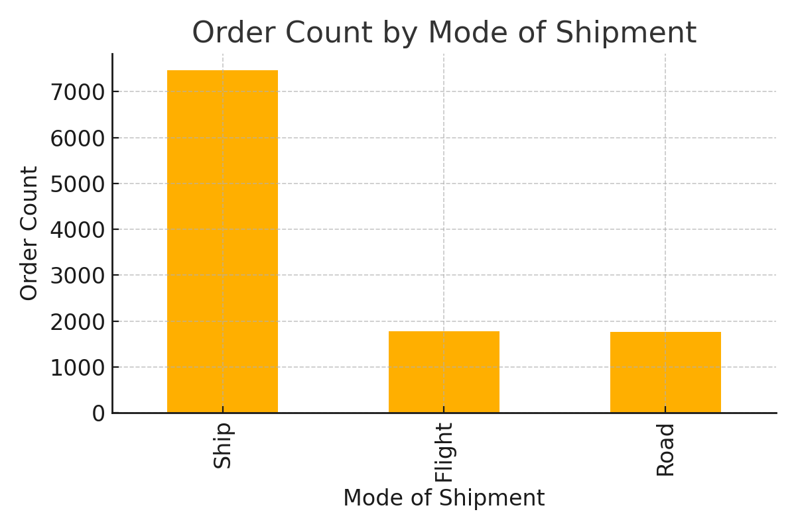
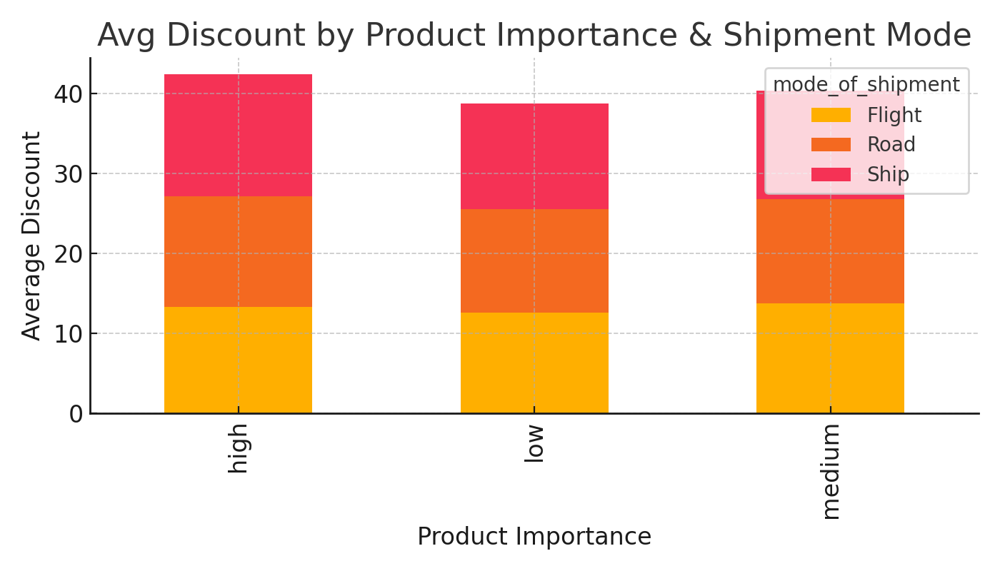
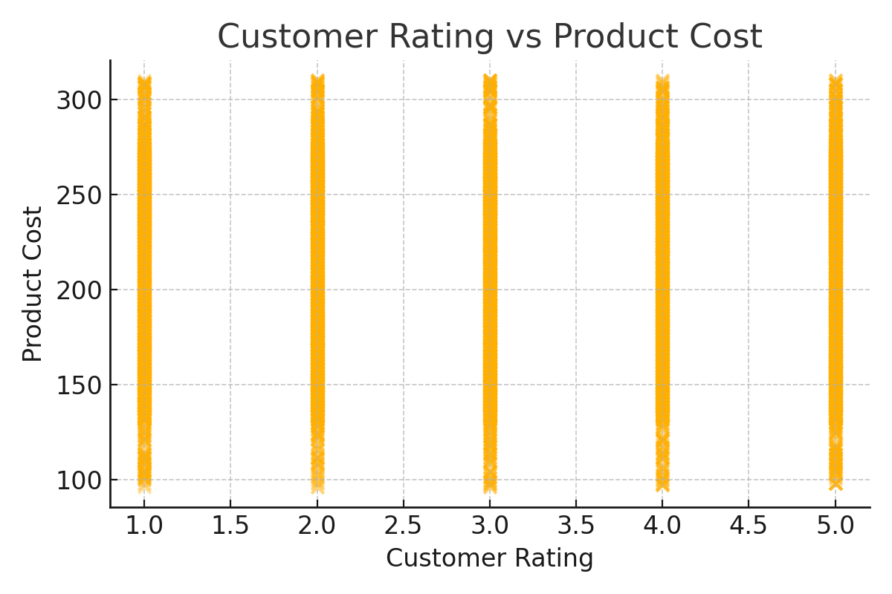
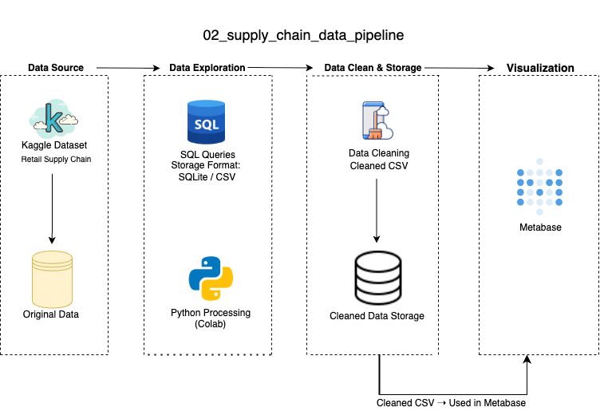

## Overview
This project analyzes supply chain efficiency using a cleaned dataset of 10,999 shipment records. It highlights operational bottlenecks, delivery timeliness, and product shipment cost-performance through structured SQL logic and dashboard visualization.

## Data Visualization
The dashboard includes the following charts:





## Data Architecture



## Prerequisites
- Python 3.10+
- Pandas / metabase
- SQLite
- Metabase 

## How to Run This Project
```bash
# Step 1: Load data (already cleaned)
# Step 2: Use visualization script or Metabase dashboard builder
# Step 3: Review insights from chart outputs
```
## Lessons Learned
- Product cost and customer rating are not always correlated
- Discounts vary more significantly by shipment method than product tier
- Shipment mode optimization directly impacts delivery timeliness

## Contact
For questions or collaboration: Linkedin and Tiwtter
