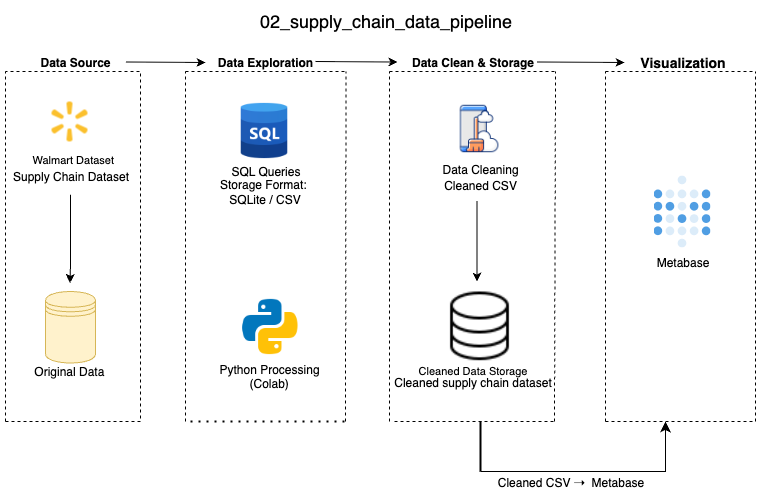

## Overview 项目总览

This project evaluates Walmart’s supply chain efficiency using a cleaned dataset of 421,570 weekly sales records. It identifies sales patterns, seasonal demand shifts, and inventory turnover issues through Python data processing, SQL-based analysis, and Metabase dashboard visualization.

** 中文说明 (项目简介) ** 本项目基于清洗后的 421,570 条沃尔玛每周销售记录数据，评估其供应链运作效率。通过 Python 数据处理、SQL 分析与 Metabase 仪表板可视化，识别销售模式、季节性需求变化及库存周转问题。

## Data Visualization 数据可视化

- The dashboard includes shipment mode distribution, discount patterns across product importance levels, and the relationship between customer ratings and shipping costs—providing a comprehensive assessment of supply chain efficiency.
  * 本仪表板包括运输方式分布、不同产品重要性下的折扣情况，以及客户评分与运输成本的关系，用于综合评估供应链效率。

- Below are screenshots of the final visualizations:  
  * 以下为本项目生成的最终可视化图表示例截图：


## Data Architecture 数据流程图

- This project uses Python and standard SQL to build the data querying logic, and leverages Metabase to create front-end dashboards—resulting in a data-driven, interactive analytics system.
  * 项目使用 Python 和标准 SQL 构建数据查询逻辑，利用 Metabase 构建前端图表，实现数据驱动的交互式分析系统。



## SQL Analysis SQL 分析

- Query: Shipment Mode Efficiency  
  *（不同运输方式的平均成本与运输时长）

```sql
SELECT Mode_of_Shipment,
       AVG(Cost_of_the_Product) AS AvgCost,
       AVG(Weight_in_gms) AS AvgWeight
FROM supply_chain_data
GROUP BY Mode_of_Shipment;
```

** Insight 洞察：** 
- Certain shipping modes incur higher costs despite similar average weights.
  * 部分运输方式在重量相近情况下仍产生较高成本，存在优化空间。

## Prerequisites 环境依赖

- Before running the project, ensure the following:
  * 在运行本项目之前，请确保以下环境准备已完成：
    
- Python 3.10 or above is recommended. Use Pandas for basic processing, Metabase for visualization, and optionally SQLite for local data management.
  * 推荐使用 Python 3.10 以上版本，使用 Pandas 进行基础处理，Metabase 进行可视化，也可选用 SQLite 做本地数据管理。

- Google Colab or local Jupyter environment
  * 推荐使用 Google Colab 直接运行，亦支持本地 Jupyter 环境，只需配置好 Python 即可。
    
 - metabase
   * Metabase 用于交互式仪表板，数据可视化
     
 - SQLite (optional for local storage)
   * 可选：同样可以用于本地执行 SQL 查询的轻量数据库 SQLite
  
- All SQL scripts in this project are designed using standard SQL syntax. While executed with SQLite for simplicity, the same structure is compatible with MySQL or PostgreSQL by changing the database connector and placeholder syntax (`?` → `%s`).
  * 本项目 SQL 脚本采用标准语法，可在 SQLite、MySQL、PostgreSQL 等数据库中灵活迁移，需根据数据库修改连接方式与参数占位符。
   
- This project can be executed both on Google Colab and local Jupyter Notebook.
  * 所有脚本支持在 Google Colab 中直接运行，同时也兼容本地 Jupyter Notebook 环境。只需确保 Python 3.x 与相关库已正确安装，即可在本地复现全部流程与输出结果。     
    
## How to Run This Project 如何运行本项目

- This project includes three modular Python scripts and one SQL-based visualization step:
  * 本项目采用三段式 Python 脚本结构与一个 SQL 可视化步骤，完成数据清洗、管道构建、数据导出与 KPI 查询展示：

- Step 1: Clean the raw retail data
 （clean_data.py）
  * 第一步：使用 Python 清洗原始零售订单数据，处理缺失值与异常记录（clean_data.py）

- Step 2: Construct a KPI data pipeline
  (pipeline.py)
  * 第二步：构建 KPI 指标计算的数据流程 (pipeline.py)

- Step 3: Export the cleaned data for SQL analysis
  (run_pipeline.py)
  * 第三步：将清洗后的数据导出为 CSV，用于后续 SQL 查询 (run_pipeline.py)

- Step 4: Run SQL queries and visualize KPIs in Metabase
  * 第四步：在 Metabase 中加载 CSV 数据，运行 SQL 查询并可视化 KPI 图表

## Lessons Learned 学习亮点

- This project reveals that customer ratings are not always proportional to shipping costs. Discount levels vary significantly across shipment methods, and optimizing the delivery mode plays a crucial role in improving fulfillment efficiency.
  * 本项目发现客户评分与运输成本不总是成正比，不同运输方式下折扣差异显著，运输模式优化对提高交付效率具有重要影响。

 - Product cost and customer rating are not always correlated
   * 客户评分与产品成本不总是正相关，部分低成本产品仍可获得高评分
     
 - Discounts vary more significantly by shipment method than product tier
   * 不同运输方式下，折扣策略差异显著，运输成本结构具有分层特征
     
 - Shipment mode optimization directly impacts delivery timeliness
   * 优化运输模式对提升交付效率具有直接推动作用，属于核心业务杠杆
