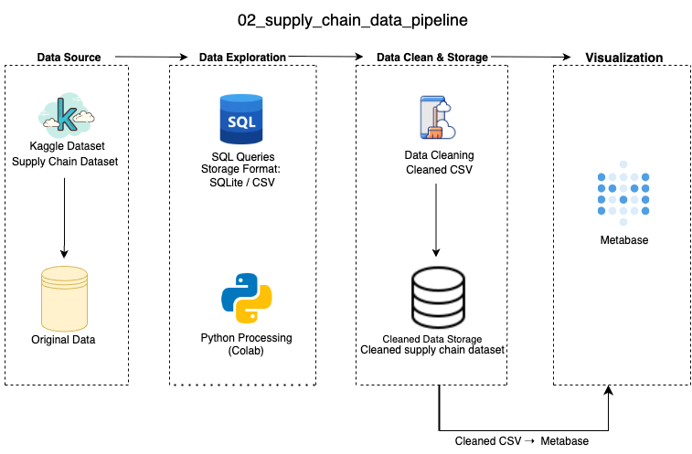

## 中文说明（项目简介）
本项目分析了 10,999 条运输记录，旨在评估供应链的运作效率。通过标准化 SQL 查询和 Metabase 可视化图表，识别交付延迟、运输模式与成本效益的关系，辅助运营优化。适合展示数据查询、分析与可视化结合的完整流程。

## Overview
This project analyzes supply chain efficiency using a cleaned dataset of 10,999 shipment records. It highlights operational bottlenecks, delivery timeliness, and product shipment cost-performance through structured SQL logic and dashboard visualization.

## Data Visualization
** 📝 中文说明：** 本仪表板包括运输方式分布、不同产品重要性下的折扣情况，以及客户评分与运输成本的关系，用于综合评估供应链效率。

The dashboard includes the following charts:

## Data Architecture
** 📝 中文说明：** 项目使用 Python 和标准 SQL 构建数据查询逻辑，利用 Metabase 构建前端图表，实现数据驱动的交互式分析系统。

## Prerequisites
** 📝 中文说明：** 推荐使用 Python 3.10 以上版本，使用 Pandas 进行基础处理，Metabase 进行可视化，也可选用 SQLite 做本地数据管理。

- Python 3.10+
  * Python 3.10 或更高版本
- Pandas / metabase
  * 安装 pandas，用于数据载入与基础处理；Metabase 用于交互式仪表板  
- SQLite (optional for local storage)
  * 可选：用于本地执行 SQL 查询的轻量数据库 SQLite
    
## How to Run This Project
** 📝 中文说明：** 本项目不需额外清洗步骤。直接载入已清洗数据，使用 SQL 脚本或 Metabase 构建图表，即可获得可视化结果。

- Step 1: Load data (already cleaned)
  * 第一步：载入已清洗的数据文件（如 `supply_chain_data_cleaned.csv`）
- Step 2: Use visualization script or Metabase dashboard builder
  * 第二步：运行 SQL 脚本或在 Metabase 中手动构建仪表板
- Step 3: Review insights from chart outputs
  * 第三步：通过图表交互分析运输方式、成本、折扣与客户评分之间的关系
    
Note on SQL Compatibility:
All SQL scripts in this project are designed using standard SQL syntax. While executed with SQLite for simplicity, the same structure is compatible with MySQL or PostgreSQL by changing the database connector and placeholder syntax (`?` → `%s`).
 - ** 中文补充说明：**  本项目 SQL 脚本采用标准语法，可在 SQLite、MySQL、PostgreSQL 等数据库中灵活迁移，需根据数据库修改连接方式与参数占位符。
   
## Lessons Learned
**📝 中文说明：** 本项目发现客户评分与运输成本不总是成正比，不同运输方式下折扣差异显著，运输模式优化对提高交付效率具有重要影响。

- Product cost and customer rating are not always correlated
- Discounts vary more significantly by shipment method than product tier
- Shipment mode optimization directly impacts delivery timeliness
