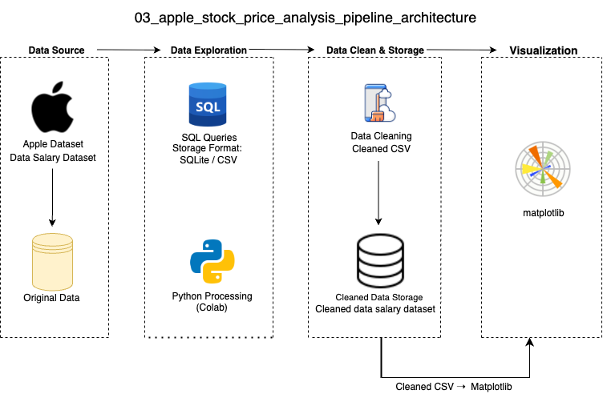

## Overview 项目总览

This project analyzes Apple Inc.’s stock price trends using historical daily trading data. It examines patterns in closing prices, trading volumes, and moving averages to identify potential market signals. The analysis follows a structured ETL pipeline with Python for data cleaning, SQL for query-based insights, and Matplotlib for visual representation.

** 中文说明 (项目简介) ** 本项目基于苹果公司历史股票交易数据，分析其收盘价、交易量及移动平均线变化趋势，挖掘潜在市场信号。项目采用 Python 进行数据清洗，结合 SQL 进行查询分析，并通过 Matplotlib 实现可视化展示。

## Data Visualization 数据可视化

- This project uses Matplotlib to visualize Apple Inc.’s stock price trends, including daily closing prices, trading volume distribution, and comparisons of short-term and long-term moving averages.
  * 本项目利用 Matplotlib 绘制苹果公司股票价格的可视化图表，包括每日收盘价走势、交易量分布，以及短期与长期移动平均线的对比分析。

- Below are screenshots of the final visualizations:  
  * 以下为本项目生成的最终可视化图表示例截图：


## Data Architecture 数据流程图

- This project applies modular Python scripts for data cleaning and pipeline construction, producing static visualizations of Apple Inc.’s stock performance with Matplotlib—highlighting an engineering-oriented workflow and clear analytical outputs.
  * 本项目采用模块化 Python 脚本完成数据清洗与管道构建，并利用 Matplotlib 生成苹果公司股票表现的静态可视化图表，突出工程化流程与清晰的分析成果。



## SQL Analysis SQL 分析

```sql
SELECT experience_level,
       ROUND(AVG(salary_in_usd), 2) AS avg_salary
FROM salary_data
GROUP BY experience_level
ORDER BY avg_salary DESC;
```

** Insight 洞察：**  
- Apple’s stock shows significant upward trends during major product launch periods.
  * 苹果公司股票在重大产品发布期间呈现显著的上升趋势

## Prerequisites 环境准备

- Before running the project, ensure the following:
  * 在运行本项目之前，请确保以下环境准备已完成：
    
- Use Python version 3.10 or above.  
  * 用于运行项目用于脚本编写与流程控制的主要编程语言，推荐使用 3.10 或以上版本以确保兼容性和最新功能支持。
    
- Google Colab or local Jupyter environment
  * 推荐使用 Google Colab 直接运行，亦支持本地 Jupyter 环境，只需配置好 Python 即可。
    
- matplotlib
  * 用于数据处理与图表绘制
    
- SQLite – for SQL query processing
  * SQLite – 用于 SQL 查询处理

- All SQL scripts in this project are designed using standard SQL syntax. They are executed using SQLite for simplicity, but can be adapted to MySQL or PostgreSQL by adjusting the database connector and placeholder syntax (`?` → `%s`).
  * 本项目中的 SQL 脚本使用标准语法，默认在 SQLite 上运行。如需迁移至 MySQL 或 PostgreSQL，只需修改数据库连接方式与参数占位符格式（如将 `?` 替换为 `%s`）。

- This project can be executed both on Google Colab and local Jupyter Notebook.
  * 所有脚本支持在 Google Colab 中直接运行，同时也兼容本地 Jupyter Notebook 环境。只需确保 Python 3.x 与相关库已正确安装，即可在本地复现全部流程与输出结果。
    
## How to Run This Project 任何运行本项目

- Run the three Python scripts in sequence: start with data cleaning, then build the analysis pipeline, and finally generate the visual outputs. It is recommended to use VS Code or Google Colab for execution and review.
  * 依次运行三个 Python 脚本，先进行数据清洗，再构建分析流程，最终输出图像。建议使用 VS Code 或 Colab 执行查看。

- Run the preprocessing script:
  * 运行预处理脚本：
  
- Step 1: Load and Clean the raw dataset
   (clean_data.py)
  * 第一步：载入并清洗原始薪资数据，处理缺失值与标准化字段 (clean_data.py)
     
- Step 2: Build the analysis pipeline
   (pipeline.py)
  * 第二步：构建分析流程，生成分组、聚合与特征字段 (pipeline.py)
     
- Step 3: Execute the pipeline
   (run_pipeline.py)
  * 第三步：运行主流程，输出分析结果与结构化数据文件 (run_pipeline.py)
        
- Step 4: Review the output visuals (matplotlib charts)
  * 第四步：查看自动生成的图表，包括每日收盘价走势、交易量分布，以及短期与长期移动平均线对比。
    
## Lessons Learned 学习亮点

- This project finds that Apple’s stock price is strongly influenced by major product launches, trading volume fluctuations often align with market news, and moving averages help reveal long-term trends.
  * 本项目发现苹果公司股票价格受重大产品发布影响显著，交易量波动常与市场新闻同步，移动平均线有助于揭示长期趋势。

- Product launch events significantly impact stock performance
  * 产品发布事件对股票表现具有显著影响，发布期内价格波动幅度明显增大。

- Trading volume patterns often correlate with market sentiment
  * 交易量变化常与市场情绪高度相关，新闻热点会引发显著成交量波动。

- Moving averages provide clearer long-term trend signals
  * 移动平均线能提供更清晰的长期趋势信号，有助于区分短期波动与持续走势。
