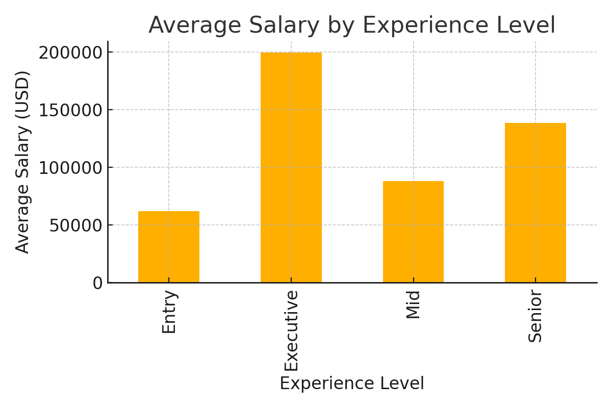
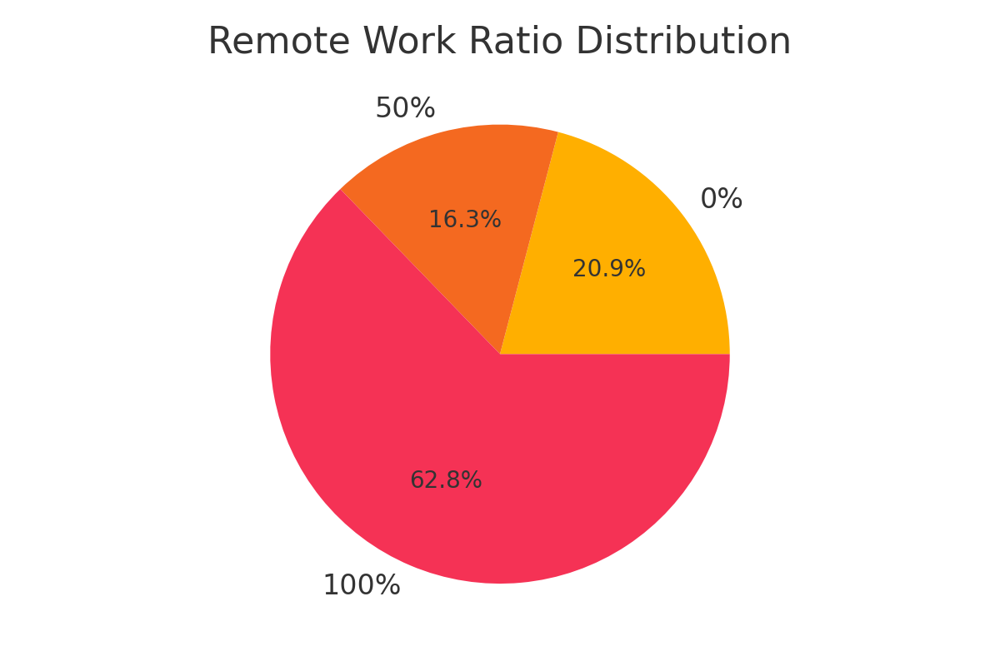
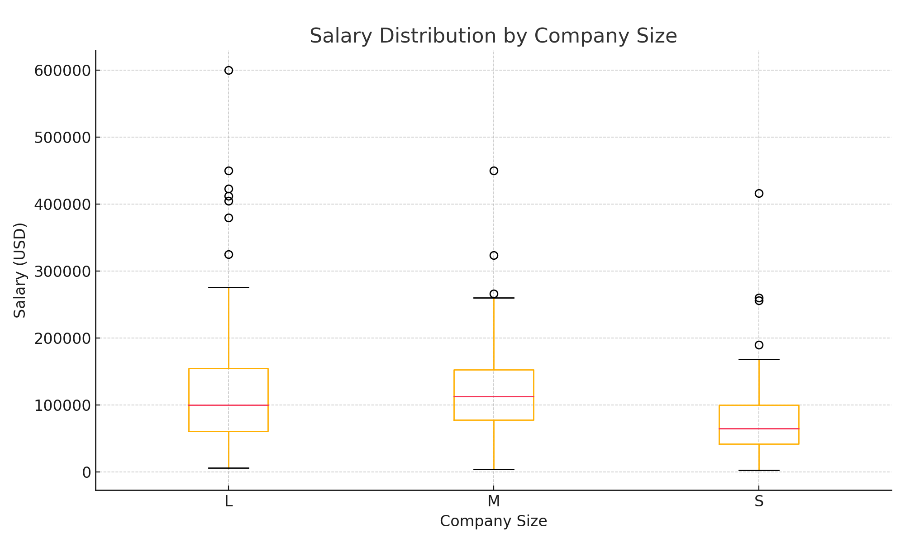
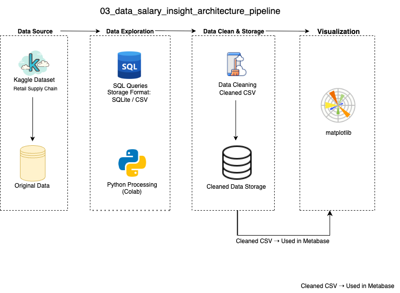

## Overview
This project explores salary trends in data science roles globally. It highlights differences based on job level, company size, and work flexibility using structured pipeline processing and visual outputs.

** 中文说明（项目简介）**
- 本项目分析了全球范围内数据科学岗位的薪资趋势。通过 Python 数据管道处理，结合 Matplotlib 图表可视化，揭示了不同职位级别、公司规模与远程工作比例下的薪资差异。项目展示了清洗 → 分析 → 可视化的完整流程，适合教学演示与求职展示。

## Data Visualization
** 中文说明：** 本项目使用 Matplotlib 绘制图表，展示了平均薪资与职位经验等级、远程办公比例分布、不同公司规模下的薪资差异。

Below are screenshots of the final visualizations:  
- ** 中文说明：** 以下为本项目生成的最终可视化图表示例截图：

## Data Architecture
** 中文说明：** 本项目采用模块化 Python 脚本进行数据清洗与管道构建，并通过 Matplotlib 输出静态可视化图像，体现工程结构与教学演示兼容性。

## Prerequisites
** 中文说明：** 请使用 Python 3.10 或以上版本，项目依赖 Pandas 和 Matplotlib。若需使用 SQL 脚本分析，可选用 SQLite 环境。

Before running the project, ensure the following:
* 在运行本项目之前，请确保以下环境准备已完成：

- Python 3.10+
  * 推荐使用 Python 3.10 或以上版本 
- pandas / matplotlib
  * 所需库：用于数据处理与图表绘制
- SQLite (optional for local storage)
  * 将数据文件 `ds_salaries.csv` 放入 `data/` 文件夹中
    
## How to Run This Project
** 中文说明：** 依次运行三个 Python 脚本，先进行数据清洗，再构建分析流程，最终输出图像。建议使用 VS Code 或 Colab 执行查看。

Run the preprocessing script:
* 运行预处理脚本：
  
- Step 1: Load and Clean the raw dataset
python clean_data.py
  * 第一步：载入并清洗原始薪资数据，处理缺失值与标准化字段

- Step 2: Build the analysis pipeline
python pipeline.py
  * 第二步：构建分析流程，生成分组、聚合与特征字段
    
- Step 3: Execute the pipeline
python run_pipeline.py
  * 第三步：运行主流程，输出分析结果与结构化数据文件
    
- Step 4: Review the output visuals (matplotlib charts)
  * 第四步：查看自动生成的图表，包括不同地区、经验水平与公司规模维度下的薪资对比
    
Note on SQL Compatibility:
* 中文说明：关于 SQL 兼容性

- All SQL scripts in this project are designed using standard SQL syntax. They are executed using SQLite for simplicity, but can be adapted to MySQL or PostgreSQL by adjusting the database connector and placeholder syntax (`?` → `%s`).
  - ** 中文说明：** 本项目中的 SQL 脚本使用标准语法，默认在 SQLite 上运行。如需迁移至 MySQL 或 PostgreSQL，只需修改数据库连接方式与参数占位符格式（如将 `?` 替换为 `%s`）。

## Lessons Learned
** 中文说明：** 本项目发现职位等级对薪资影响显著，远程办公趋势因地区而异，公司规模对薪资离散度也有重要影响。

- Position level significantly influences salary outcomes
  * 职位等级对薪资水平具有显著影响，高级职位平均薪资明显更高
- Remote roles show highly diverse regional distribution patterns
  * 远程岗位在地域分布上呈现高度多样性，海外远程比例较高  
- Company size contributes to variability in salary dispersion
  * 公司规模影响薪资分布的离散程度，大型企业内部薪资差异更复杂
