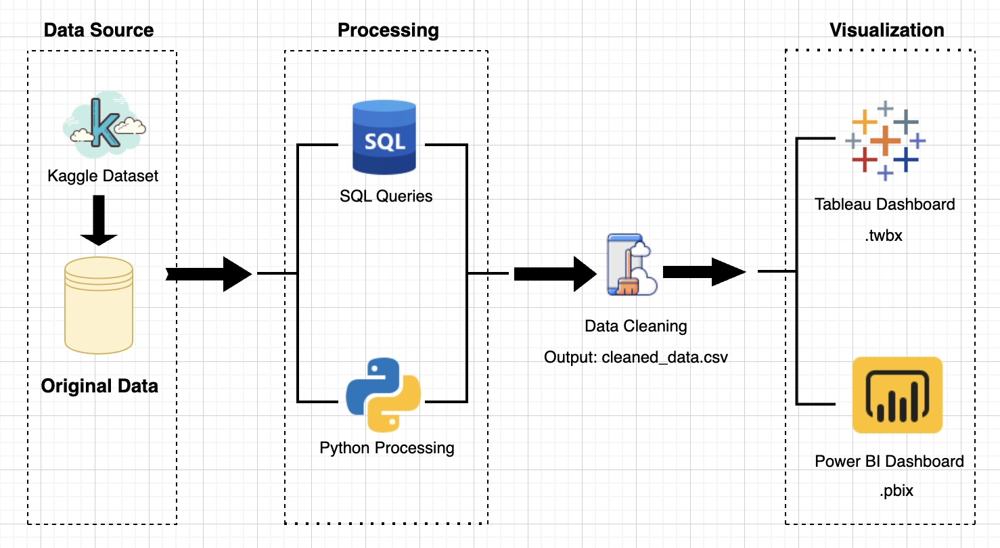

## Overview

This project analyzes global data science salaries using real-world job data from Kaggle. The goal is to explore how salary varies by experience level, job title, and company location. The project demonstrates a full pipeline from raw data cleaning to structured insights.

## Data Visualization

Below are final visualizations generated in tabelau/ Power BI:

Power BI Dashboard

Tableau Dashboard

## Data Architecture

## Prerequisites

Before running this project, ensure the following are installed or available:

- Python 3.x (or Google Colab)
- `pandas`
- Tableau Public (for dashboard creation)
- Power BI Desktop
  
## How to Run This Project

- Upload the original dataset `data_science_salaries_raw.csv`
- Run the data cleaning script to generate `data_science_salaries_cleaned.csv`
- Run the analysis pipeline: bash python run_pipeline.py
- Load the cleaned CSV into Tableau and Power BI to build dashboards

## 🎓 Lessons Learned

- Field naming standardization is key to reproducible workflows
- Mapping and grouping enables fast aggregation insights
- Python script modularization makes project easier to maintain
- Simple .groupby() operations can already deliver business value

## Contact
Feel free to reach out for collaboration or questions: LinkedIn: Zheng Lyu GitHub: ZhengLyu-Data
