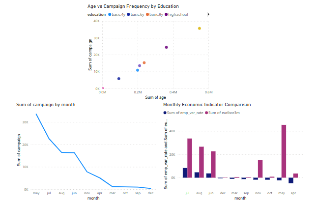

## 📊 Bank Marketing Campaign Analysis

This project analyzes marketing campaign performance and customer behavior for a Portuguese retail bank.  
It combines Python, SQL, Tableau, and Power BI to explore customer segmentation, engagement frequency, and macroeconomic correlations. The project is designed for showcasing end-to-end BI capability for analyst roles.

---

## 🗂️ Project Structure

```
04_bank_marketing_campaign_analysis/
├── data/
│   ├── bank_marketing_raw.csv                         # Original dataset
│   ├── bank_marketing_cleaned.csv                     # Cleaned dataset for visualization
│   └── bank-additional-names.txt                      # Metadata label file
├── scripts/
│   ├── bank_marketing_dataset.sql                     # SQL Data extraction & transformation script
│   └── bank_marketing_dataset.python                  # Python cleaning script
├── dashboard/
│   ├── bank_marketing_customer_explorer.twbx          # Tableau workbook (customer segmentation)
│   ├── bank_marketing_customer_exloer.preview.png     # Tableau dashboard preview
│   ├── bank_marketing_behavior_signal.pbix            # Power BI dashboard (campaign + economics)
│   ├── powerbi_dashboard_overview.png                 # Power BI dashboard preview
└── README.md
```

---

## 🧹 Data Cleaning

Performed in Python (pandas):

- Removed duplicates and irrelevant records
- Normalized categorical columns (job, education, contact)
- Created clean, analysis-ready file: `bank_marketing_cleaned.csv`

---

## 🔍 Key Insights

- 🧑‍💼 Different job types and education levels show distinct campaign responsiveness
- 📆 Campaign intensity varies month to month, peaking in May and October
- 💸 euribor3m and emp_var_rate reveal macroeconomic shifts that align with engagement fluctuations

---

## 📈 Power BI Dashboard

📁 File: `bank_marketing_behavior_signal.pbix`  
📷 Preview:  


**Includes:**

- Age vs Campaign Frequency by Education (scatter plot)
- Monthly Campaign Intensity Trend (line chart)
- Monthly Economic Indicator Comparision Heatmap (matrix chart)

---

## 📊 Tableau Dashboard

📁 File: `bank_marketing_customer_explorer.twbx`  
📷 Preview:  


**Includes:**

- Job distribution by month and education
- Age and campaign frequency scatter
- Multidimensional segmentation dashboard

---

## 🛠️ Tools Used

- Python (pandas, matplotlib)
- SQL (SQLite for query logic)
- Tableau Public
- Microsoft Power BI

---

## 📬 Contact

For collaboration, feedback, or walkthrough requests, feel free to reach out via LinkedIn https://www.linkedin.com/in/zheng-lyu-951295323/
