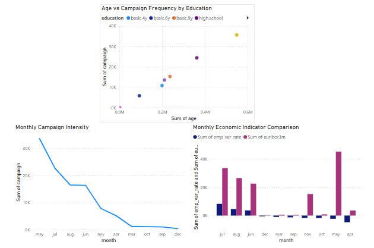

## 📊 Bank Marketing Campaign Analysis

This project analyzes marketing campaign performance and customer behavior for a Portuguese retail bank.  
It combines Python, SQL, Tableau, and Power BI to explore customer segmentation, engagement frequency, and macroeconomic correlations. The project is designed for showcasing end-to-end BI capability for analyst roles.

---

## 🗂️ Project Structure

```
04_bank_marketing_campaign_analysis/
├── data/
│   ├── bank_marketing_raw.csv                               # Original dataset
│   ├── bank_marketing_cleaned.csv                           # Cleaned dataset for visualization
│   └── bank-additional-names.txt                            # Metadata label file
├── scripts/
│   ├── bank_marketing_dataset.sql                           # SQL Data extraction & transformation script
│   └── bank_marketing_dataset.python                        # Python cleaning script
├── dashboard/
│   ├── bank_marketing_customer_explorer.twbx                # Tableau workbook (customer segmentation)
│   ├── bank_marketing_customer_exloer.preview.png           # Tableau dashboard preview image
│   ├── bank_marketing_behavior_signal.pbix                  # Power BI dashboard (campaign + economics)
│   ├── bank_marketing_customer_behavior_dashbaord.png       # Power BI dashboard preview image
└── README.md
```

---

## 📥 Dataset Source

This project uses the [Bank Marketing Dataset](https://www.kaggle.com/datasets/henriqueyamahata/bank-marketing) from Kaggle.  
The dataset includes client information, previous marketing interactions, economic indicators, and final subscription outcomes.

---

## 🧹 Data Cleaning

Performed in Python (pandas):

- Removed duplicates and irrelevant records
- Normalized categorical columns (job, education, contact)
- Created clean, analysis-ready file: `bank_marketing_cleaned.csv`

---

## 🔍 Key Insights

- 🧑‍💼 Different job types and education levels show distinct campaign responsiveness
- 📆 Campaign intensity varies month to month, peaking in May and October
- 💸 euribor3m and emp_var_rate reveal macroeconomic shifts that align with engagement fluctuations

---

## 📈 Power BI Dashboard

📁 File: `bank_marketing_behavior_signal.pbix`  
📷 Preview:  


**Includes:**

- Age vs Campaign Frequency by Education (scatter plot)
- Monthly Campaign Intensity Trend (line chart)
- Monthly Economic Indicator Comparision Heatmap (matrix chart)

> Open `.pbix` using Power BI Desktop to explore the interactive visuals.

---

## 📊 Tableau Dashboard

📁 File: `bank_marketing_customer_explorer.twbx`  
📷 Preview:  


**Includes:**

- Job distribution by month and education
- Age and campaign frequency scatter
- Multidimensional segmentation dashboard

> Open `.twbx` using Tableau Public (free) or Tableau Desktop 2022.1+.

---

## 🛠️ Tools Used

- Python: Pandas, Numpy, Matplotlib
- SQL: MySQL used for querying relational datasets
- Microsoft Power BI: Built interactive dashboards and visual analytics
- Tableau Public: Alternative BI tool for dashboard comparison
- Google Colab/Github: For cloud-based development and collaboration

---

## 📬 Contact

For collaboration, feedback, or walkthrough requests, feel free to reach out via LinkedIn https://www.linkedin.com/in/zheng-lyu-951295323/
