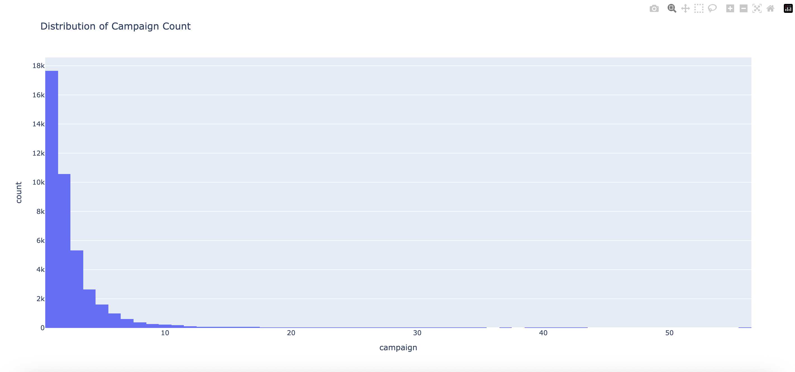
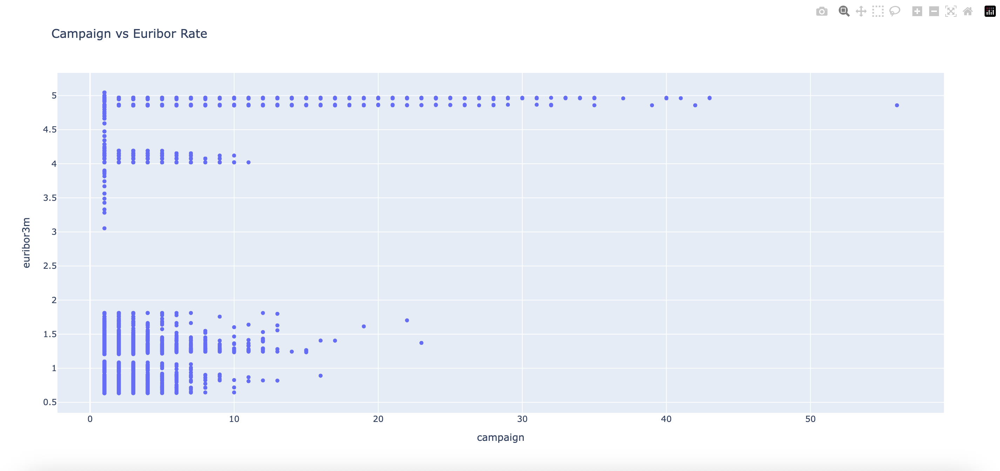
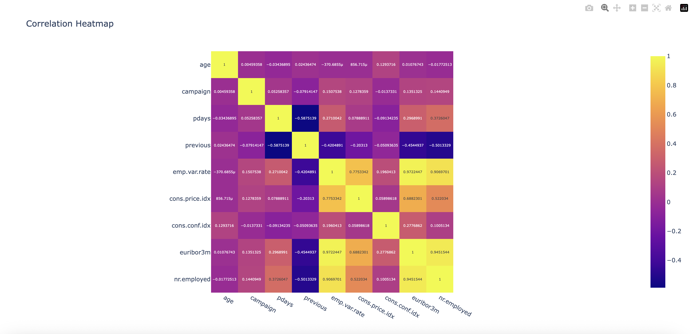
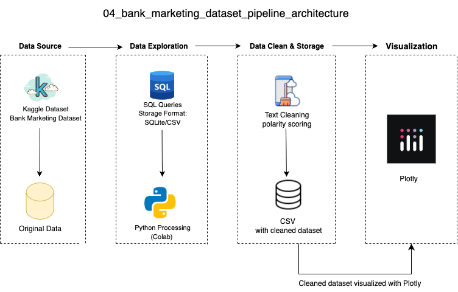

## Overview / 项目总览

This project analyzes a bank marketing dataset to identify factors influencing customer subscription to term deposits. The goal is to build an interpretable, efficient, and presentation-ready project using a lightweight CSV file and clean code structure.

** 中文说明 (项目简介) ** 本项目基于银行营销数据集，探索影响客户订阅定期存款的关键因素。目标是构建一个结构清晰、可视化美观、便于展示的轻量级数据分析项目。

## Data Visualization / 数据可视化

- All visualizations are created using Plotly and exported as interactive HTML files and downloadable PNGs.
  * 所有图表均使用 Plotly 创建，并以交互式 HTML 和 PNG 下载格式输出。
    
- Below are screenshots of the final visualizations:  
  * 以下为本项目生成的最终可视化图表示例截图：

  
  

## Data Architecture / 数据流程图

- This project uses modular Python scripts for data cleaning and pipeline construction, and generates static visualizations using Matplotlib—demonstrating both an engineering-oriented structure and compatibility with teaching presentations.  
  * 本项目采用模块化 Python 脚本进行数据清洗与管道构建，并通过 Matplotlib 输出静态可视化图像，体现工程结构与教学演示兼容性。

## 🗃️ SQL Analysis / SQL 分析

- Query: Subscription Rate by Education Level  
  *（不同教育程度的订阅成功率分析）

sql
SELECT education,
       COUNT(*) AS total_customers,
       SUM(CASE WHEN y = 'yes' THEN 1 ELSE 0 END) AS subscribed,
       ROUND(100.0 * SUM(CASE WHEN y = 'yes' THEN 1 ELSE 0 END) / COUNT(*), 2) AS subscription_rate_pct
FROM bank_marketing
GROUP BY education
ORDER BY subscription_rate_pct DESC;

** Insight / 洞察：**
- Higher education level is correlated with a higher subscription rate.
- 高学历客户的订阅成功率更高，营销应针对性细分。

##  Prerequisites / 环境准备

- Use Python version 3.10 or above.  
  * 推荐使用 Python 3.10 或以上版本，确保兼容性和新特性支持。

- Google Colab or local Jupyter environment  
  * 推荐使用 Google Colab 运行，亦支持本地 Jupyter 环境。

- Plotly 
  * 用于图表绘制的可视化库

- SQLite – for SQL query processing  
  * 用于执行 SQL 查询分析的轻量数据库

- All SQL scripts in this project are written in standard SQL syntax, defaulted to SQLite. To adapt to MySQL or PostgreSQL, adjust connectors and parameter placeholders.  
  * 所有 SQL 脚本基于标准语法，默认使用 SQLite。如需迁移至其他数据库，调整连接方式及参数符号即可。

- This project can be executed both on Google Colab and local Jupyter Notebook.
  * 所有脚本支持在 Google Colab 中直接运行，同时也兼容本地 Jupyter Notebook 环境。只需确保 Python 3.x 与相关库已正确安装，即可在本地复现全部流程与输出结果。

## How to Run This Project / 如何运行本项目

- 1. Step 1: Load and Clean the raw dataset (`clean_data.py`)  
  * 载入并清洗原始数据，处理缺失值与字段规范
  
- 2. Step 2: Build the analysis pipeline (`pipeline.py`)  
  * 构建分析流程，完成特征处理与分组统计

- 3. Step 3: Execute and visualize (`run_pipeline.py`)  
  * 运行主脚本，生成所有图表与结构化输出

## Lessons Learned / 学习亮点

- Minimal yet professional project structure
  * 项目结构简洁但专业，图表美观
    
- Quick turnaround with one main query and clean Plotly visuals
  * 单一 SQL 分析维度，突出重点
  
- Demonstrates business insights in the context of banking customer acquisition and targeted marketing strategies
  * 展示了银行领域客户获取和精准营销的洞察价值

