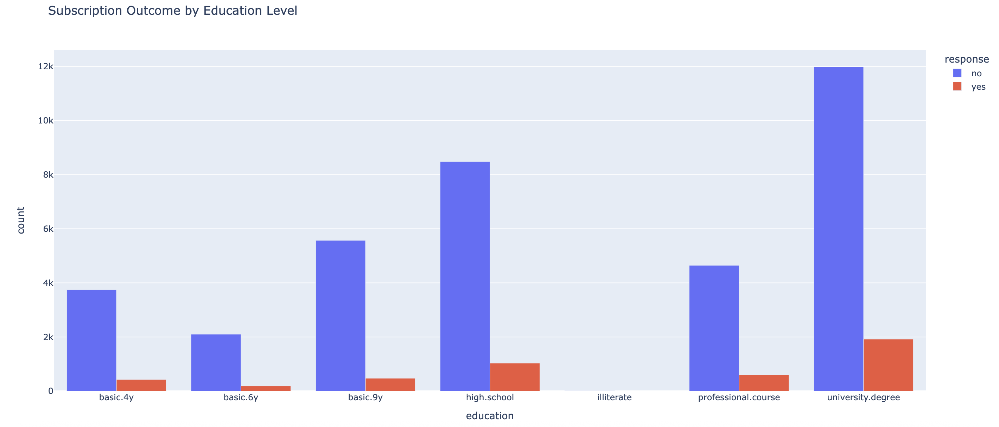
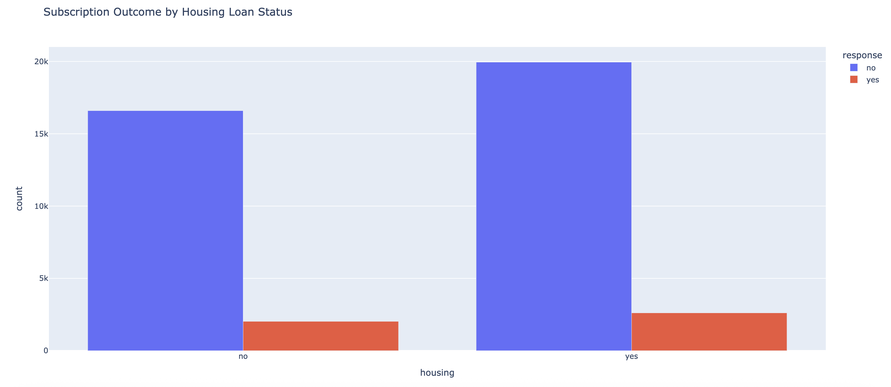
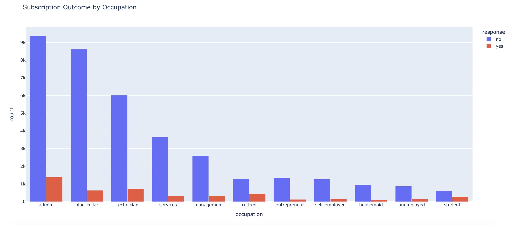

## Overview 项目总览
This project analyzes customer responses to a marketing campaign by a Portuguese bank. The goal is to identify which customer attributes and contact methods are associated with higher subscription rates.

** 中文说明 (项目简介) **  本项目基于葡萄牙银行营销数据，分析不同客户特征与联络方式对营销订阅成效的影响。通过 Python 数据处理与可视化，识别哪些用户群体对营销活动响应更积极，有助于银行精准营销策略制定。适合教学演示或面向商业分析岗位的项目展示。

## Data Visualization | 可视化概览

This project presents three interactive charts generated using Plotly, exported as static images for quick preview, and available as downloadable HTML files for full interactivity.

** 中文说明 ** 本项目使用 Plotly 生成三张交互式图表，提供静态图片用于快速浏览，并附带 HTML 下载链接以支持完整交互体验。

Below are screenshots of the final visualizations:  

** 中文说明 ** 以下为本项目生成的最终可视化图表示例截图：

🔗 [Download Interactive Chart](./visualizations/subscription_by_education.html)

 
  
🔗 [Download Interactive Chart](./visualizations/subscription_by_housing.html)

  
  
🔗 [Download Interactive Chart](./visualizations/subscription_by_occupation.html)

## Data Architecture 数据流程图

This project builds a structured data pipeline from cleaning to analysis and output. By combining logical segmentation with visualization models, it provides insights for modeling customer behavior in banking scenarios.

** 中文说明 ** 本项目构建了清洗 → 分析 → 输出的结构化数据管道，结合逻辑判断与可视化模型，为银行客户行为建模提供参考。

## Prerequisites 环境准备

- Prepare a Python environment (recommended version 3.10+), and install the required libraries: pandas and matplotlib. SQLite can be optionally used for SQL-based analysis.
  * 请准备 Python 环境（建议 3.10+），安装 pandas 与 matplotlib，如需执行 SQL 分析可选用 SQLite 环境。
- Before running the project, ensure the following:
  * 在运行本项目之前，请确保以下环境准备已完成：
- Python 3.10+
  * 推荐 Python 3.10 或更高版本
- pandas / matplotlib
  * 用于数据处理与图表生成 
- SQLite (optional for intermediate storage)
  * 可选：用于本地 SQL 分析与中间结果存储

## How to Run This Project 如何运行本项目

This project consists of three Python modules executed in sequence: data cleaning → pipeline construction → analytical visualization output. It is suitable for teaching and project demonstration purposes.

** 中文说明 ** 本项目共含三个 Python 模块，运行顺序为：数据清洗 → 数据管道构建 → 输出分析图表，可用于教学与项目演示。

Run the preprocessing script:

** 运行预处理脚本：

- Step 1: Load and Clean the dataset
python clean_data.py
  * 第一步：载入并清洗原始银行营销数据，处理缺失值与字段格式
- Step 2: Build the pipeline
python pipeline.py
  * 第二步：构建数据处理流程，生成分组、统计与衍生字段   
- Step 3: Run the full analysis
python run_pipeline.py
  * 第三步：执行完整分析管道，输出结构化分析结果   
- Step 4: View visual outputs (matplotlib)
  * 第四步：查看输出图表，探索不同特征维度对营销结果的影响
    
Note on SQL Compatibility:

** 中文说明 ** 关于 SQL 兼容性
  
All SQL scripts in this project are designed using standard SQL syntax. While executed with SQLite for simplicity, the same structure is compatible with MySQL or PostgreSQL by changing the database connector and placeholder syntax (`?` → `%s`).
  
** 中文说明 ** 本项目使用的 SQL 脚本基于标准语法，当前以 SQLite 运行为主，也可迁移至 MySQL / PostgreSQL，仅需修改数据库连接方式与参数占位符格式。
    
This project can be executed both on Google Colab and local Jupyter Notebook.

** 中文说明 ** 所有脚本支持在 Google Colab 中直接运行，同时也兼容本地 Jupyter Notebook 环境。只需确保 Python 3.x 与相关库已正确安装，即可在本地复现全部流程与输出结果。

## Lessons Learned 学习亮点

- This project reveals that marketing contact methods significantly impact conversion rates. It also highlights clear response preferences across different age groups and education levels, which can help optimize target audience segmentation strategies.
  * 本项目揭示了营销联络方式对转化率有显著影响，且客户年龄段与教育程度之间存在明显的响应偏好，可辅助优化目标人群筛选策略。
- Contact method plays a role in campaign success
  * 客户接触方式（如电话、短信等）对营销转化成功率有显著影响
- Younger and older demographics have distinct subscription patterns
  * 年龄与教育程度两个维度下的客户响应模式差异明显 
- Education level correlates with campaign responsiveness
  * 可基于分析结果优化目标人群的筛选策略与沟通方式
