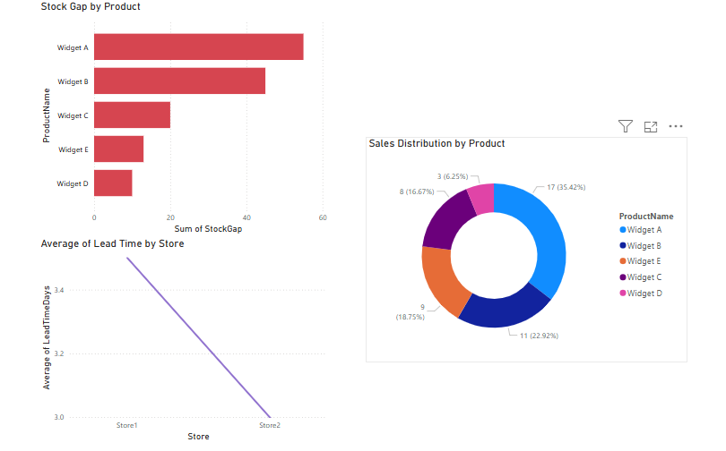

## 📌 Overview
This project focuses on automating inventory replenishment analysis across multiple stores. It utilizes Python for data cleaning, SQL for querying insights, and Tableau for interactive dashboard creation. The goal is to visualize stock levels, sales activity, and delivery timelines to improve replenishment decisions.

## 📁 Folder Structure
```
04_smart_replenishment/
│
├── smart_replenishment.ipynb          # Python notebook for data cleaning and transformation
├── smart_replenishment_sample.csv     # Simulated raw dataset
├── cleaned_replenishment.csv          # Cleaned dataset used in Tableau
├── smart_replenishment.sql            # SQL queries for analysis
├── SmartReplenishmentDashboard.png    # Screenshot of final dashboard
├── powerbi_dashboard_screenshot.png   # Screenshot of PowerBI dashboard
└── README.md                          # Project documentation
```

## 🧹 Data Cleaning
- Removed duplicates and missing values
- Verified proper data types for date and numeric fields
- Created derived fields for stock gap analysis and reorder flag (if applicable)

## 📊 Tableau Visualizations
| Chart | Description |
|-------|-------------|
| 📈 **Stock vs Reorder Point** | Bar chart comparing current stock to reorder point per product |
| 🧾 **Reorder Need by Category** | Bar chart of products below reorder threshold, grouped by category |
| 🔁 **Forecast vs Stock by Warehouse** | Side-by-side bars comparing forecasted demand vs actual inventory |

View the dashboard here: [Smart Replenishment Dashboard](https://public.tableau.com/app/profile/zheng.lyu6601/viz/Smart_replenishment/Smart_replenishment) 📌 The dashboard was created and published using Tableau Public.

## 🖼️ Dashboard Preview:  


## 🧠 SQL Analytics
Executed in SQLFiddle to simulate backend queries:
- Total units sold per product
- Products below reorder threshold
- Average lead time by store
- Daily sales summary per store
- Stock gap prioritization for urgent reorder

File: `smart_replenishment.sql`

## 💬 Notebook Language Notice
The notebook file `smart_replenishment.ipynb` is entirely written in English to align with professional standards. It is hosted on Google Colab to demonstrate cloud-native development.
