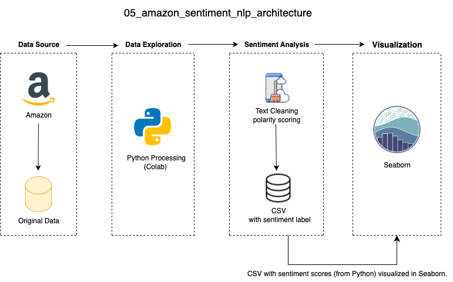

## 中文说明（项目简介）
本项目基于 Amazon 食品评论数据集，使用 Python 与自然语言处理（NLP）技术分析评论情感倾向。通过 TextBlob 模型对评论文本进行极性分析，分为正面、中性与负面类别，并输出词云图与情感分布图。项目涵盖数据清洗、情感标签生成、可视化输出等完整文本分析流程，适用于教学与实战演示。

## Overview
This project analyzes sentiment in Amazon food product reviews using natural language processing (NLP). It classifies reviews as positive, neutral, or negative using TextBlob and visualizes the results using Python libraries. The pipeline demonstrates data ingestion, preprocessing, sentiment analysis, and visualization.

## Data Visualization
** 📝 中文说明：** 本项目通过 Python 可视化库生成情感分布图与词云，帮助直观理解评论情绪倾向与高频词汇分布。

Below are screenshots of the final visualizations:

Sentiment Distribution 

Word Cloud 

## Data Architecture
** 📝 中文说明：** 项目架构由数据读取、文本预处理、情感分析与图像输出四部分组成，支持教学展示与模型原理讲解。

Note: Tableau dashboards in this project are based on the NLP results exported from Python scripts. The visualizations represent sentiment distribution, polarity trends, and top review insights derived from TextBlob/VADER outputs.

## Prerequisites
** 📝 中文说明：** 建议使用 Python 3.x 及以下库（或在 Colab 环境中操作），将原始评论数据放入 `data/` 文件夹。

- Before running the project, ensure the following: Python 3.x installed (or use Google Colab)
- Install required libraries: pandas, numpy, textblob, matplotlib, wordcloud
- Place Reviews.csv into the data/ directory

## How to Run This Project
** 📝 中文说明：** 运行流程分为 3 步：进入项目目录 → 执行主脚本 → 生成情感标签与可视化图表。

- Open terminal or Google Colab
- Navigate to the project folder: cd 05_amazon_review_nlp

 Run the analysis pipeline: 
 
- python scripts/analysis_pipeline.py
- Outputs will be saved to:
- Labeled reviews: /data/clean_reviews_labeled.csv
- Word cloud and sentiment distribution plots: /visualizations/

## Lessons Learned
** 📝 中文说明：** 本项目揭示了规则基础的情感分析（如 TextBlob）在原型搭建中速度快但精度有限，适合作为教学范例或实际文本分析入门项目。
- Rule-based sentiment classification (TextBlob) is fast and easy, but less accurate than ML model
- Combining score fields and polarity improves label consistency
- Creating the dataset is essential for fast prototyping and visualization
- Python scripting enables modular and reproducible NLP workflows

## Contact
Please feel free to contact me if you have any questions: Linkedin, Twitter
