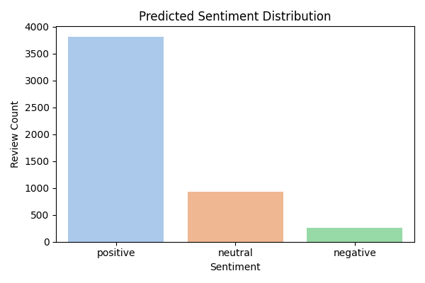
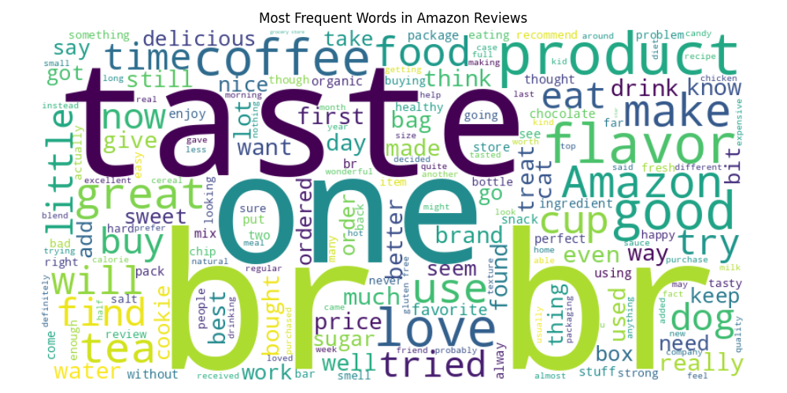
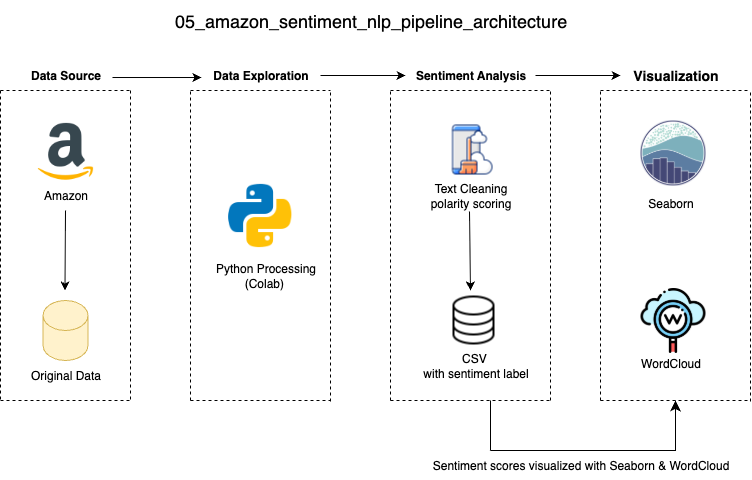

## Overview 项目总览
This project analyzes sentiment in Amazon food product reviews using natural language processing (NLP). It classifies reviews as positive, neutral, or negative using TextBlob and visualizes the results using Python libraries. The pipeline demonstrates data ingestion, preprocessing, sentiment analysis, and visualization.

** 中文说明 (项目简介) ** 本项目基于 Amazon 食品评论数据集，使用 Python 与自然语言处理（NLP）技术分析评论情感倾向。通过 TextBlob 模型对评论文本进行极性分析，分为正面、中性与负面类别，并输出词云图与情感分布图。项目涵盖数据清洗、情感标签生成、可视化输出等完整文本分析流程，适用于教学与实战演示。

## Data Visualization 数据可视化

This project uses Python visualization libraries to generate sentiment distribution charts and word clouds, offering intuitive insights into emotional tendencies and frequent terms in the reviews.

** 中文说明 ** 本项目通过 Python 可视化库生成情感分布图与词云，帮助直观理解评论情绪倾向与高频词汇分布。

Below are screenshots of the final visualizations: 

** 中文说明 ** 以下为本项目生成的最终可视化图表示例截图：

Seaborn Dashboard 数据可视化

.

Wordcloud Dashboard 数据可视化

.

## Data Architecture 数据流程图

The project structure consists of four components: data loading, text preprocessing, sentiment analysis, and visualization output. It is designed to support teaching demonstrations and explain model fundamentals.

** 中文说明 ** 项目架构由数据读取、文本预处理、情感分析与图像输出四部分组成，支持教学展示与模型原理讲解。

Note: Tableau dashboards in this project are based on the NLP results exported from Python scripts. The visualizations represent sentiment distribution, polarity trends, and top review insights derived from TextBlob/VADER outputs.

** 中文说明 ** ：本项目中的 Tableau 仪表板基于从 Python 脚本导出的自然语言处理（NLP）结果构建。可视化图表展示了情感分布、情感极性变化趋势，以及基于 TextBlob/VADER 分析提取的重点评论洞察。

## Prerequisites 环境准备

It is recommended to use Python 3.x and the required libraries (or operate in a Colab environment). Place the original review dataset into the data/ folder.

** 中文说明 ** 建议使用 Python 3.x 及以下库（或在 Colab 环境中操作），将原始评论数据放入 `data/` 文件夹。

Before running the project, ensure the following:

** 在运行本项目之前，请确保以下环境准备已完成：

Before running the project, ensure the following: Python 3.x installed (or use Google Colab)
  * 安装 Python 3.x（或直接使用 Colab 无需配置）
Install required libraries: pandas, numpy, textblob, matplotlib, wordcloud
  * 安装所需库：用于数据处理、情感分析与可视化
Place Reviews.csv into the data/ directory
  * 将原始数据文件 `Reviews.csv` 放入 `data/` 文件夹

## How to Run This Project 如何运行本项目

- The workflow consists of three steps: navigate to the project directory → run the main script → generate sentiment labels and visualizations.
  * 运行流程分为 3 步：进入项目目录 → 执行主脚本 → 生成情感标签与可视化图表。
- Run the preprocessing script:
  *运行预处理脚本：
- Open terminal or Google Colab
  * 打开终端或 Google Colab 环境
- Navigate to the project folder: cd 05_amazon_review_nlp
  * 进入项目目录：`05_amazon_review_nlp`
- Run the analysis pipeline:
   python scripts/analysis_pipeline.py
  * 执行主分析脚本，完成清洗、情感打标与图像生成

Outputs will be saved to:
   
** 中文说明 ** 所有输出文件将自动保存至以下路径：

Labeled reviews: /data/clean_reviews_labeled.csv

** 中文说明 ** 含情感标签的清洗数据集：`data/clean_reviews_labeled.csv`

Word cloud and sentiment distribution plots: /visualizations/

** 中文说明 ** 词云图与情感分布图：保存在 `visualizations/` 文件夹中
     
This project can be executed both on Google Colab and local Jupyter Notebook.

** 中文说明 ** 所有脚本支持在 Google Colab 中直接运行，同时也兼容本地 Jupyter Notebook 环境。只需确保 Python 3.x 与相关库已正确安装，即可在本地复现全部流程与输出结果。

## Lessons Learned 学习亮点

- This project demonstrates that rule-based sentiment analysis tools like TextBlob are fast and effective for rapid prototyping, though limited in accuracy. They are well-suited for teaching purposes or as an introduction to practical text analytics.
  * 本项目揭示了规则基础的情感分析（如 TextBlob）在原型搭建中速度快但精度有限，适合作为教学范例或实际文本分析入门项目。
- Rule-based sentiment classification (TextBlob) is fast and easy, but less accurate than ML model
  * 基于规则的情感分析方法（如 TextBlob）可快速搭建原型，但在处理复杂语义上精度较低
- Combining score fields and polarity improves label consistency
  * 同时结合评分字段与情感极性（polarity）可提高标签一致性 
- Creating the dataset is essential for fast prototyping and visualization
  * 自建标签数据集有助于快速探索与原型迭代
- Python scripting enables modular and reproducible NLP workflows
  * 使用 Python 脚本可实现模块化、可复现的 NLP 分析流程
