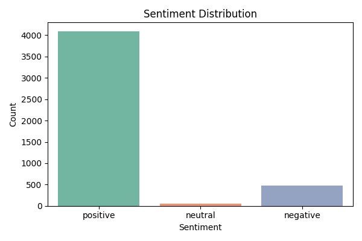
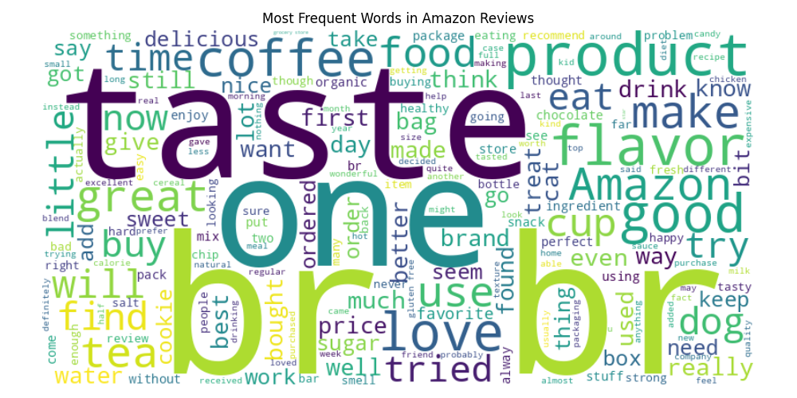
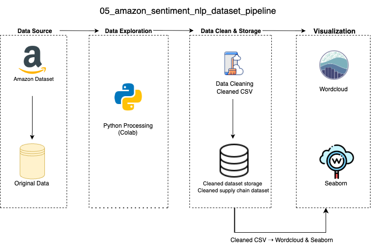

## Overview 项目总览
This project analyzes sentiment in Amazon food product reviews using natural language processing (NLP). It classifies reviews as positive, neutral, or negative using TextBlob and visualizes the results using Python libraries. The pipeline demonstrates data ingestion, preprocessing, sentiment analysis, and visualization.

** 中文说明 (项目简介) **  本项目基于 Amazon 食品评论数据集，使用 Python 与自然语言处理（NLP）技术分析评论情感倾向。通过 TextBlob 模型对评论文本进行极性分析，分为正面、中性与负面类别，并输出词云图与情感分布图。项目涵盖数据清洗、情感标签生成、可视化输出等完整文本分析流程，适用于教学与实战演示。

## Data Visualization 数据可视化

- This project uses Python visualization libraries to generate sentiment distribution charts and word clouds, offering intuitive insights into emotional tendencies and frequent terms in the reviews.
  * 本项目通过 Python 可视化库生成情感分布图与词云，帮助直观理解评论情绪倾向与高频词汇分布。

- Below are screenshots of the final visualizations: 
  * 以下为本项目生成的最终可视化图表示例截图：

Seaborn Dashboard 数据可视化

.

Wordcloud Dashboard 数据可视化

.

## Data Architecture 数据流程图

- The project structure consists of four components: data loading, text preprocessing, sentiment analysis, and visualization output. It is designed to support teaching demonstrations and explain model fundamentals.
  * 项目架构由数据读取、文本预处理、情感分析与图像输出四部分组成，支持教学展示与模型原理讲解。

- Note: Tableau dashboards in this project are based on the NLP results exported from Python scripts. The visualizations represent sentiment distribution, polarity trends, and top review insights derived from TextBlob/VADER outputs.
  * 本项目中的 Tableau 仪表板基于从 Python 脚本导出的自然语言处理（NLP）结果构建。可视化图表展示了情感分布、情感极性变化趋势，以及基于 TextBlob/VADER 分析提取的重点评论洞察。

## Prerequisites 环境准备

- Before running the project, ensure the following:
  * 在运行本项目之前，请确保以下环境准备已完成：

- Python 3.10+
  * 用于运行项目用于脚本编写与流程控制的主要编程语言，推荐使用 3.10 或以上版本以确保兼容性和最新功能支持。

- Google Colab or local Jupyter environment
  * 推荐使用 Google Colab 直接运行，亦支持本地 Jupyter 环境，只需配置好 Python 即可。
    
- Install required libraries: python, numpy, textblob, matplotlib, wordcloud
  * 安装所需库：用于数据处理、情感分析与可视化

## How to Run This Project 如何运行本项目

如何运行本项目
This project includes three modular Python scripts:
本项目采用三段式脚本结构，分别完成数据清洗、数据管道构建与可视化分析：

Step 1: Clean raw review data using Python 
第一步：使用 Python 清洗原始评论数据，处理缺失值与文本规范化

Step 2: Build sentiment analysis pipeline and export CSV
第二步：构建情感分析流程，将情感分类结果输出为 CSV 文件

Step 3: Visualize sentiment distribution and save charts
第三步：读取分析结果并生成情感图表，图像保存为本地文件（PNG 格式）

## Lessons Learned 学习亮点

- This project demonstrates that rule-based sentiment analysis tools like TextBlob are fast and effective for rapid prototyping, though limited in accuracy. They are well-suited for teaching purposes or as an introduction to practical text analytics.
  * 本项目揭示了规则基础的情感分析（如 TextBlob）在原型搭建中速度快但精度有限，适合作为教学范例或实际文本分析入门项目。
- Rule-based sentiment classification (TextBlob) is fast and easy, but less accurate than ML model
  * 基于规则的情感分析方法（如 TextBlob）可快速搭建原型，但在处理复杂语义上精度较低
- Combining score fields and polarity improves label consistency
  * 同时结合评分字段与情感极性（polarity）可提高标签一致性 
- Creating the dataset is essential for fast prototyping and visualization
  * 自建标签数据集有助于快速探索与原型迭代
- Python scripting enables modular and reproducible NLP workflows
  * 使用 Python 脚本可实现模块化、可复现的 NLP 分析流程
