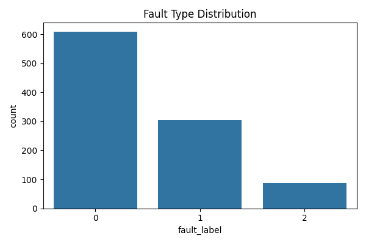
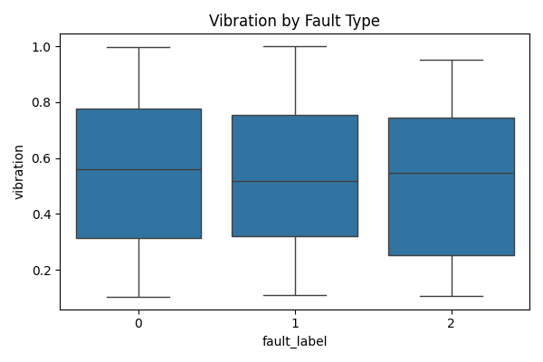
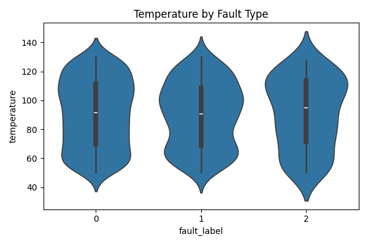
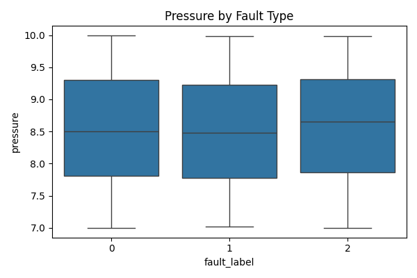
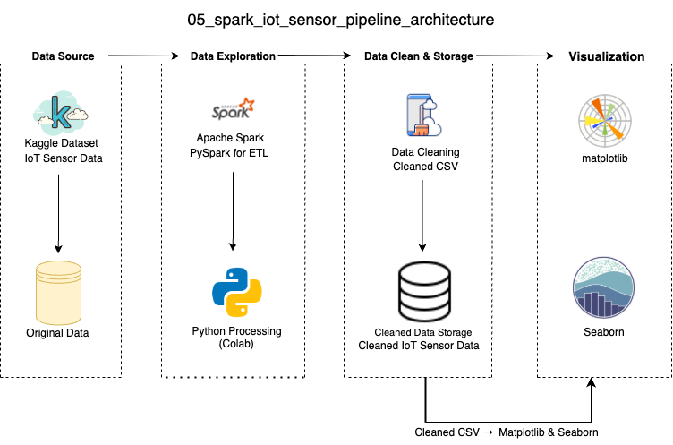

## Overview 项目总览

This project uses an IoT server sensor dataset provided by NASA and published on Kaggle. The data includes real-time system sensor readings from NASA's server infrastructure, with full time-series coverage and labeled failure points. It is widely applied in predictive maintenance, anomaly detection, and industrial equipment status monitoring tasks.

** 中文说明 (项目简介) ** 本项目基于 Kaggle 平台上的真实数据集，使用由美国国家航空航天局（NASA）提供的服务器传感器监控数据，包含服务器运行中的完整时间序列与故障标注，广泛应用于设备状态预测、工业健康监测与智能维护建模任务，具备高度的实际应用价值与工程适应性。

## Data Visualization | 可视化概览

- This project generates 4 static charts using matplotlib and seaborn to visualize sensor fault patterns across vibration, temperature, and pressure.
  * 本项目使用 matplotlib 与 seaborn 生成 4 张静态图表，直观展示不同故障类型下的振动、温度与压力分布。
 
- All charts below were generated using Seaborn for plotting and Matplotlib for layout and saving.
  * 以下所有图表均使用 Seaborn 完成绘图，并通过 Matplotlib 实现图像排版与导出。

- Below are the visualization results:
  * 以下为最终图表展示结果（已保存为 PNG 文件，可下载用于演示）：

- Fault Type Distribution - Distribution of fault categories detected from IoT sensor data.  
  * 展示来自物联网传感器数据的故障类型分布
    
  

- Vibration by Fault Type - Boxplot of vibration readings by fault classification.  
  * 展示不同故障类别下的振动水平分布箱线图
    
  

- Temperature by Fault Type - Violin plot showing temperature patterns across fault types.  
  * 展示不同故障类型下的温度分布小提琴图
    
  

- Pressure by Fault Type - Pressure distribution comparison by fault category.  
  * 展示不同故障类型下的压力分布
    
  

## Data Architecture 数据流程图

- This project follows a full pipeline from original Kaggle dataset to cleaned output and visualization.
  * 本项目完整覆盖数据采集、Spark 清洗、Python 分析与图表展示，流程清晰，工程化程度高。

## Prerequisites 环境准备

- Before running the project, ensure the following:
  * 在运行本项目之前，请确保以下环境准备已完成：

- Use Python version 3.10 or above.
  * 用于运行项目用于脚本编写与流程控制的主要编程语言，推荐使用 3.10 或以上版本以确保兼容性和最新功能支持。
    
- Apache Spark (PySpark)
  * 分布式数据处理引擎，适用于大规模数据计算。本项目使用其 Python 接口（PySpark）用于大规模数据清洗与处理。
    
- Seaborn / Matplotlib
  * 用于数据分析与可视化
    
- Google Colab or local Jupyter environment
  * 推荐使用 Google Colab 直接运行，亦支持本地 Jupyter 环境，只需配置好 Python 和 Spark 即可。

## How to Run This Project 如何运行本项目

- This project includes three modular Python scripts:
  * 本项目采用三段式脚本结构，分别完成数据清洗、数据管道构建与可视化分析：

- Step 1: Clean raw sensor data using PySpark
 （clean_data.py）  
  * 第一步：使用 PySpark 清洗原始 IoT 传感器数据，处理缺失值与类型转换（clean_data.py）  

- Step 2: Build processing pipeline and export CSV
 （pipeline.py）  
  * 第二步：构建数据管道，将清洗后的数据输出为 CSV 格式，供后续分析使用（pipeline.py）

- Step 3: Visualize fault patterns and save charts
 （run_pipeline.py）  
  * 第三步：读取清洗后的 CSV，生成图表并保存为本地文件（PNG 格式)（run_pipeline.py） 

## Lessons Learned 学习亮点

- Spark can efficiently handle large-scale sensor data
  * Spark 在处理大规模工业传感器数据方面表现出色，支持高效 ETL 流程
    
- Clear visual patterns can help detect fault types
  * 故障类型与振动、温度、压力等信号变量呈现出显著模式，有助于构建预测模型
    
- Modular structure ensures clean workflow and reproducibility
  * 模块化结构保证了流程清晰与复现能力，适合教学演示与简历展示
