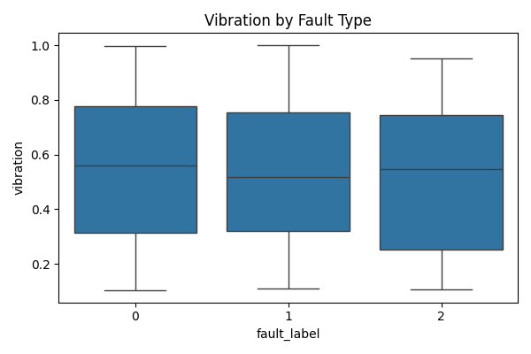

## Overview 项目总览

This project builds a Spark-based data pipeline to analyze fault patterns in industrial IoT sensor data. By leveraging PySpark for data handling and Python visualization tools, it demonstrates how real-time manufacturing signals can be transformed into actionable insights.
本项目基于工业 IoT 传感器数据，构建了一个 Spark 数据分析流程。通过使用 PySpark 进行数据处理，并结合 Python 可视化工具，探索制造过程中故障信号的识别与分析方法，适合教学展示与数据工程类岗位申请。

## Data Visualization | 可视化概览

This project generates 4 static charts using matplotlib and seaborn to visualize sensor fault patterns across vibration, temperature, and pressure.

本项目使用 matplotlib 与 seaborn 生成 4 张静态图表，直观展示不同故障类型下的振动、温度与压力分布。

Below are the visualization results:

以下为最终图表展示结果（已保存为 PNG 文件，可下载用于演示）：

- Fault Type Distribution - Distribution of fault categories detected from IoT sensor data.  
  * 展示来自物联网传感器数据的故障类型分布
    
  

- Vibration by Fault Type - Boxplot of vibration readings by fault classification.  
  * 展示不同故障类别下的振动水平分布箱线图
    
  

- Temperature by Fault Type - Violin plot showing temperature patterns across fault types.  
  * 展示不同故障类型下的温度分布小提琴图
    
  

- Pressure by Fault Type - Pressure distribution comparison by fault category.  
  * 展示不同故障类型下的压力分布
    
  

## Data Architecture 数据流程图
This project follows a full pipeline from original Kaggle dataset to cleaned output and visualization.

本项目完整覆盖数据采集、Spark 清洗、Python 分析与图表展示，流程清晰，工程化程度高。

## Prerequisites 环境准备

- Python 3.10+
  * 用于运行项目用于脚本编写与流程控制的主要编程语言，推荐使用 3.10 或以上版本以确保兼容性和最新功能支持。 
- Apache Spark (PySpark)
  * 分布式数据处理引擎，适用于大规模数据计算。本项目使用其 Python 接口（PySpark）用于大规模数据清洗与处理。
- pandas / seaborn / matplotlib
  * 用于数据分析与可视化
- Google Colab or local Jupyter environment
  * 推荐使用 Google Colab 直接运行，亦支持本地 Jupyter 环境，只需配置好 Python 与 Spark 即可。*

## How to Run This Project 如何运行本项目
This project includes three modular Python scripts:

本项目采用三段式脚本结构，分别完成数据清洗、数据管道构建与可视化分析：

- Step 1: Clean raw sensor data using PySpark
python clean_data.py  
  * 第一步：使用 PySpark 清洗原始 IoT 传感器数据，处理缺失值与类型转换

- Step 2: Build processing pipeline and export CSV
python pipeline.py  
  * 第二步：构建数据管道，将清洗后的数据输出为 CSV 格式，供后续分析使用

- Step 3: Visualize fault patterns and save charts
python run_pipeline.py  
  * 第三步：读取清洗后的 CSV，生成图表并保存为本地文件（PNG 格式）

## Lessons Learned 学习亮点

- Spark can efficiently handle large-scale sensor data
  * Spark 在处理大规模工业传感器数据方面表现出色，支持高效 ETL 流程
- Clear visual patterns can help detect fault types
  * 故障类型与振动、温度、压力等信号变量呈现出显著模式，有助于构建预测模型
- Modular structure ensures clean workflow and reproducibility
  * 模块化结构保证了流程清晰与复现能力，适合教学演示与简历展示
