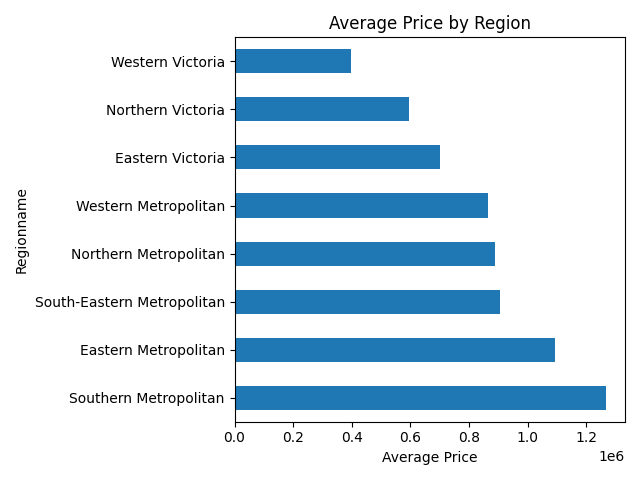
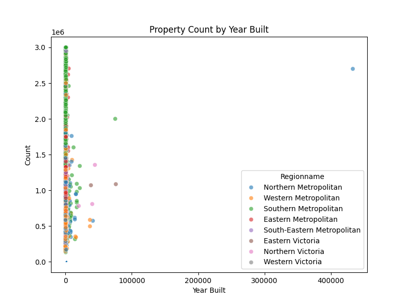
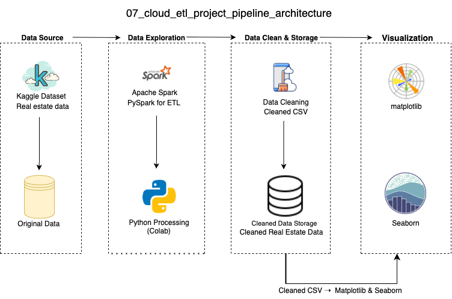

## Overview 项目简介

This project demonstrates a complete cloud-based ETL pipeline using real-world housing data. It includes data cleaning, transformation, analysis, and visualization using PySpark and Python tools. The workflow show a typical distributed ETL scenario commonly used in real estate intelligence applications.

** 中文说明 (项目简介) ** 本项目基于真实房地产数据，构建了完整的云端 ETL 数据处理流程。涵盖数据清洗、转换、分析及可视化环节，采用 PySpark 与 Python 工具链实现。 流程显示了分布式环境下的典型 ETL 管道，适用于房地产行业的数据智能应用场景。

## Data Visualization 数据可视化

- All charts are generated using **Seaborn + Matplotlib** to ensure high-quality, customizable visualization output.  
  * 所有图表均采用 Seaborn + Matplotlib 绘制，具备高质量与高度自定义能力。

- Average Price by Region - Average property price across different regions.
  * 展示不同区域的平均房产价格分布

  

- Property Count by Year Built - Number of properties grouped by year built.
  * 展示不同建成年份的房产数量统计

 

## Data Architecture 数据架构

## Prerequisites 运行环境

- Before running the project, ensure the following:
  * 在运行本项目之前，请确保以下环境准备已完成：

- Python 3.10+
  * 用于运行项目用于脚本编写与流程控制的主要编程语言，推荐使用 3.10 或以上版本以确保兼容性和最新功能支持。
    
- Apache Spark (PySpark)
  * 分布式数据处理引擎，适用于大规模数据计算。本项目使用其 Python 接口（PySpark）用于大规模数据清洗与处理。
    
- seaborn / matplotlib
  * 用于数据分析与可视化
    
- Google Colab or local Jupyter environment
  * 推荐使用 Google Colab 直接运行，亦支持本地 Jupyter 环境，只需配置好 Python 与 Spark 即可。

## How to Run This Project 如何运行本项目

- This project includes three modular Python scripts:
  * 本项目采用三段式脚本结构，分别完成数据清洗、数据管道构建与可视化分析：

- Step 1: Clean raw housing transaction data using python
  (clean_data.py)
  * 第一步：使用 pandas 清洗原始房产交易数据，处理缺失值与字段格式 (clean_data.py)

- Step 2: Build data pipeline and export results for visualization python
  (pipeline.py)
  * 第二步：构建 ETL 数据处理流程，生成用于分析的关键字段和统计结果 (pipeline.py)

- Step 3: Generate charts and save as PNG files python
  (run_pipeline.py)
  * 第三步：读取中间结果，使用 matplotlib 与 seaborn 生成图表，并保存为本地 PNG 图片格式 (run_pipeline.py)

## 🎓 Lessons Learned 学习亮点

- Built a real-world ETL pipeline with **cloud-ready logic and distributed processing design**
- Learned to combine **PySpark** and **pandas** for flexible preprocessing and transformation
- Developed multi-step data workflows based on **modular Python script structure**
- Practiced statistical visualization using **Seaborn + Matplotlib**
